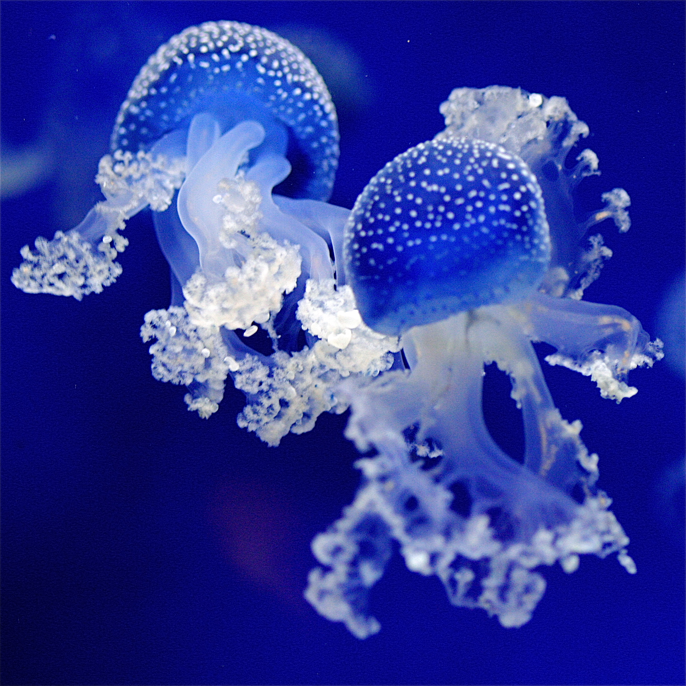

Incroyables méduses fluorescentes photographiées dans un aquarium du zoo de Rhenen, aux Pays-Bas.

<figure markdown="1">
  
</figure>

Vous pouvez voir et aimer [« Fluorescent Jellyfishes » sur 500px](http://500px.com/photo/338761).
