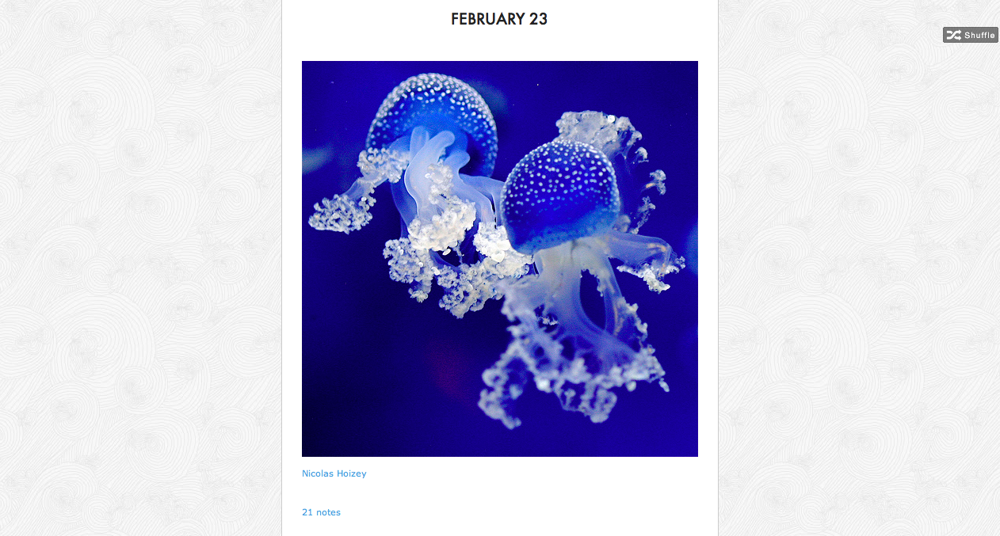
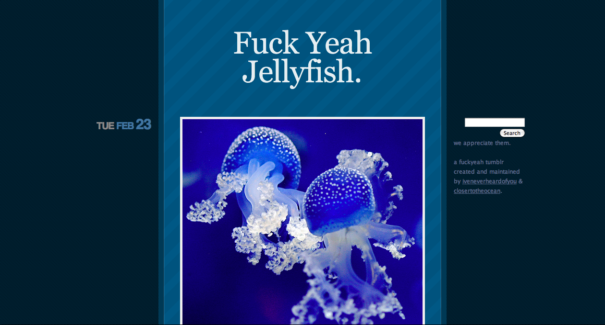
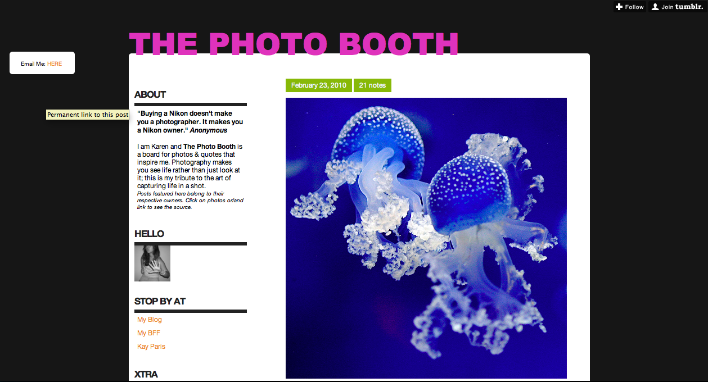
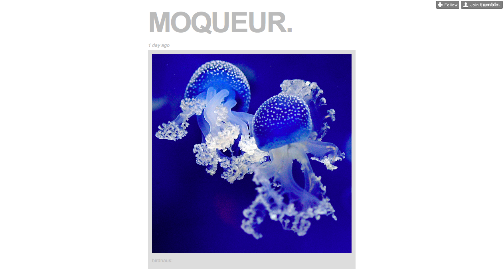
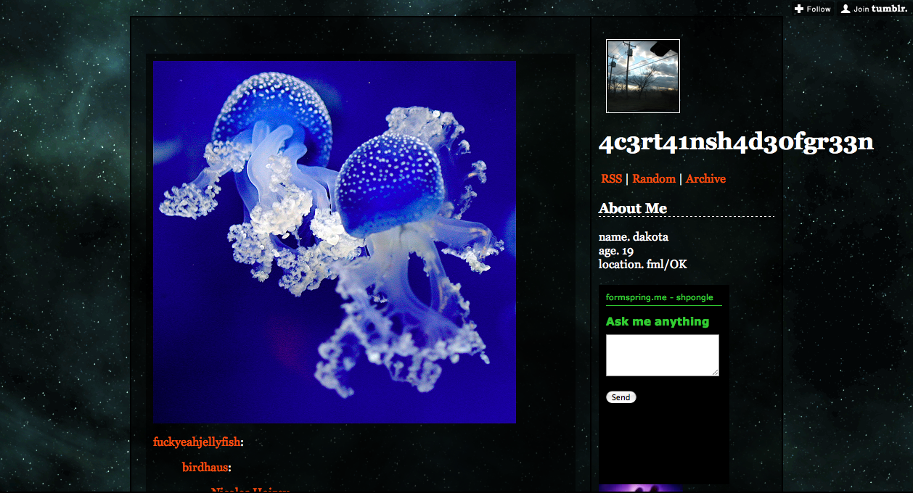
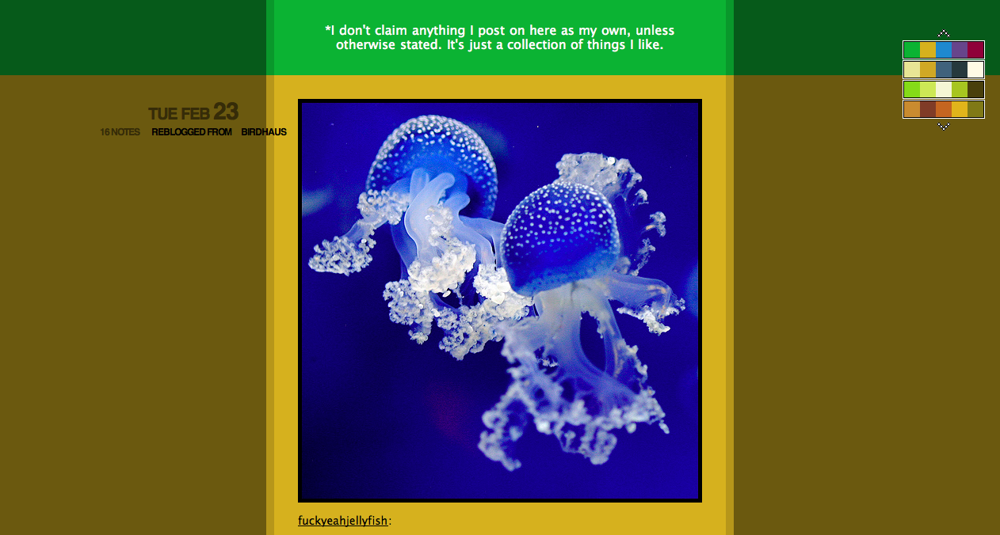
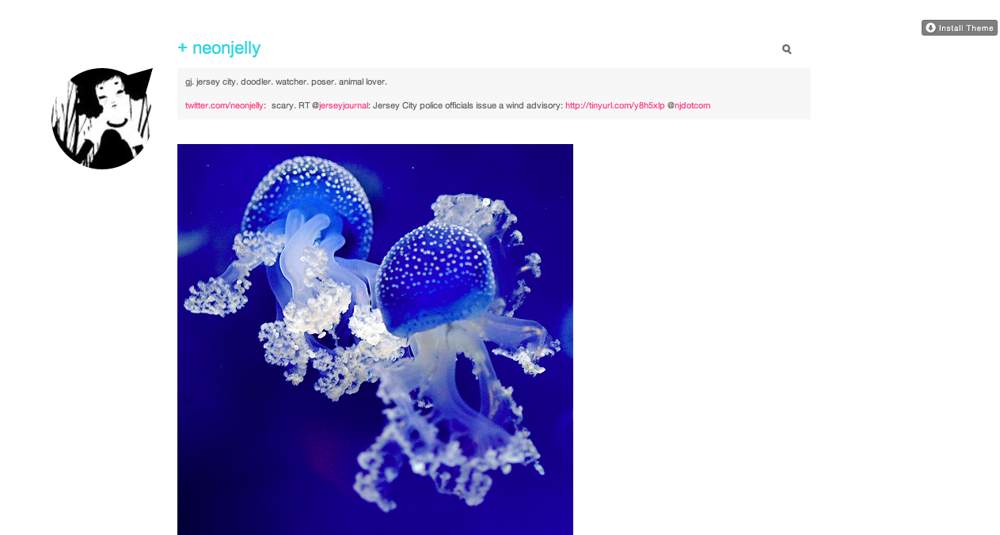

Vous avez sans doute déjà vu ma belle photo de méduses fluorescentes -- une de mes préférées -- que ce soit [ici](/2008/07/meduses-fluorescentes.html), sur [Flickr](http://www.flickr.com/photos/nicolas-hoizey/2632478734/), [JPG Magazine](http://www.jpgmag.com/photos/809995), [deviantArt](http://nhoizey.deviantart.com/art/Fluorescent-Jellyfish-90477061) ou plus récemment sur [RedBubble](http://www.redbubble.com/people/nhoizey/art/4542942-3-fluorescent-jellyfishes). Et bien elle vient d'être publiée en série sur de nombreux micro blogs [Tumblr](http://www.tumblr.com/), lui apportant une énorme visibilité.

Le premier à avoir publié la photo semble être celui-ci :

<figure markdown="1">
  
  <figcaption>
    birdhaus.tumblr.com
. <http://birdhaus.tumblr.com/post/407643793/nicolas-hoizey>
  </figcaption>
</figure>

Et il a été largement repris ensuite :

<figure markdown="1">
  
  <figcaption>
    frostybear.tumblr.com
. <http://frostybear.tumblr.com/p ost/407748576/fuckyeahjel lyfish-birdhaus-nicolas-hoizey>
  </figcaption>
</figure>

<figure markdown="1">
  
  <figcaption>
    fuckyeahjellyfish.tumblr.com
. <http://fuckyeahjellyfish.tumblr.com/post/407648432/birdhaus-nicolas-hoizey>
  </figcaption>
</figure>

<figure markdown="1">
  
  <figcaption>
    karencilla.tumblr.com
. <http://karencilla.tumblr.com/post/407665077/isnt-gods-creation-amazing-birdhaus-nicolas>
  </figcaption>
</figure>

<figure markdown="1">
  
  <figcaption>
    moqueur.tumblr.com
. <http://moqueur.tumblr.com/post/407674522/birdhaus-nicolas-hoizey>
  </figcaption>
</figure>

<figure markdown="1">
  
  <figcaption>
    acertainshadeofgreen.tumblr.com
. <http://acertainshadeofgreen.tumblr.com/post/407687092/fuckyeahjellyfish-birdhaus-nicolas-hoizey>
  </figcaption>
</figure>

<figure markdown="1">
  
  <figcaption>
    seashelllz.tumblr.com
. <http://seashelllz.tumblr.com/post/407754310/fuckyeahjellyfish-birdhaus-nicolas-hoizey>
  </figcaption>
</figure>

<figure markdown="1">
  
  <figcaption>
    meagannnn-reblog.tumblr.com
. <http://meagannnn-reblog.tumblr.com/post/407784792>
  </figcaption>
</figure>

<figure markdown="1">
  
  <figcaption>
    thaiteaa.tumblr.com
. <http://thaiteaa.tumblr.com/post/407819743/fuckyeahjellyfish-birdhaus-nicolas-hoizey>
  </figcaption>
</figure>

<figure markdown="1">
  
  <figcaption>
    strangestofinventions.tumblr.com
. <http://strangestofinventions.tumblr.com/post/408117688/fuckyeahjellyfish-birdhaus-nicolas-hoizey>
  </figcaption>
</figure>

<figure markdown="1">
  
  <figcaption>
    vinitha.tumblr.com
. <http://vinitha.tumblr.com/post/408123360/fuckyeahjellyfish-birdhaus-nicolas-hoizey>
  </figcaption>
</figure>

<figure markdown="1">
  
  <figcaption>
    blog.neonjelly.net
. <http://blog.neonjelly.net/post/407851083/fuckyeahjellyfish-birdhaus-nicolas-hoizey>
  </figcaption>
</figure>

Tout ça grâce sans aucun doute à la facilité offerte par Tumblr de faire un « Reblog », à la manière des « retweets » de Twitter :

<figure markdown="1">
  
</figure>
