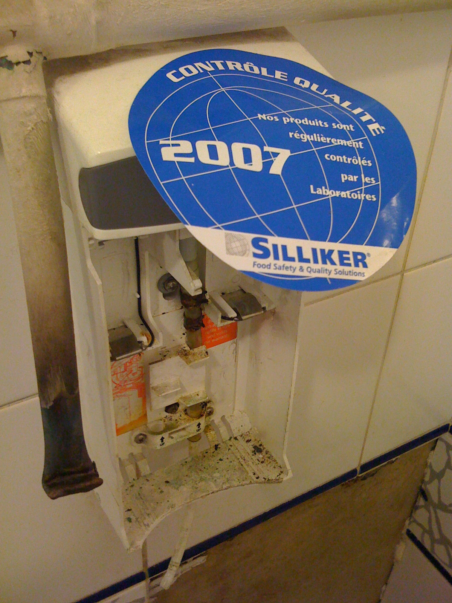

Les faire quand on les annonce, c'est mieux...

La preuve en image :

<figure>
  
  <figcaption>
  Contrôle qualité
  </figcaption>
</figure>

Je ne sais malheureusement plus où j'ai pris cette photo…
