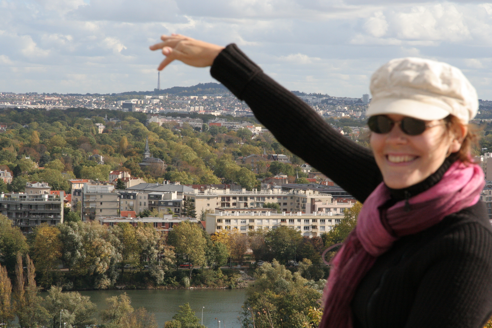

Voilà bien un sujet photographique qui a déjà largement été traité par tout un chacun, et sur lequel il est difficile d'apporter une vraie originalité. Je m'y essaie tout de même, à vous de juger !

  

  <a href="https://500px.com/photo/8341135/between-her-legs-by-nicolas-hoizey">Between her legs... by Nicolas Hoizey on 500px</a>

<figure markdown="1">
  
  <figcaption>
  Vertige
  </figcaption>
</figure>

<figure markdown="1">
  
  <figcaption>
  Aïe, ça pique !
  </figcaption>
</figure>
