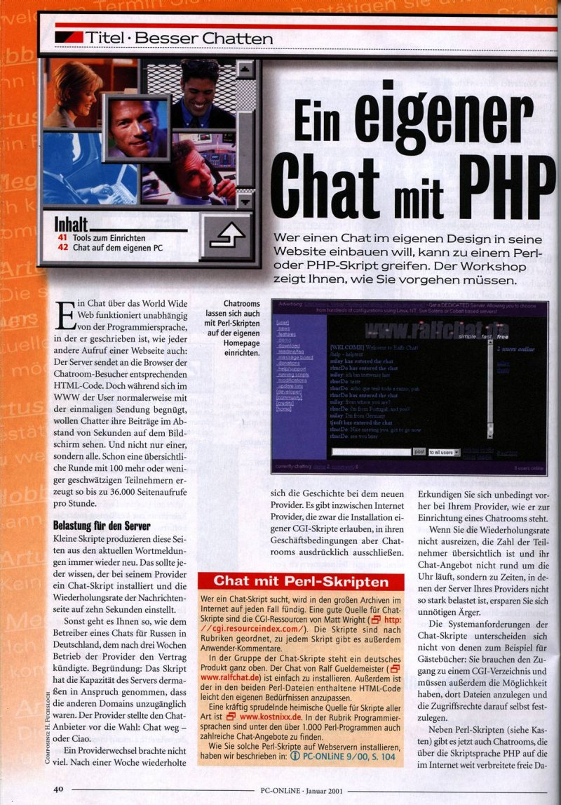

Dans ce numéro de PC Online[^pconline], journal allemand, Michael Loy propose un article de 3 pages à propos de la réalisation de chat en PHP, et prend phpMyChat en exemple, avec de nombreuses copies d'écran.

[^pconline]: Qui contrairement à ce que semble indiquer son nom est un magazine papier « traditionnel »

{.onehalf}

{.onehalf}

{.onehalf}

{.onehalf}
