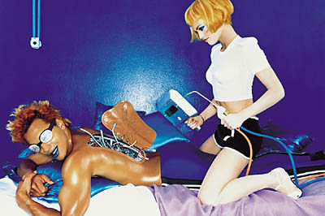

--- 
title:      "Tout Mondino en livre et en ligne" 
date: 2001-01-21 12:00:00 +02:00
lang:       fr 
tags:       [photography, book]
---

Enfin, presque…

Reconnaissable au premier coup d'oeil sur une couverture de magazine, dans une publicité ou un clip, le style Mondino a marqué la fin du siècle, et une rétrospective allait de soit. C'est chose faite avec [un livre](http://www.amazon.fr/exec/obidos/ASIN/3823899635) et [un site](http://www.mondinodejavu.com/) nommés "Mondino (Déjà Vu)".

Le site présente beaucoup d'images, mais de petite taille, histoire que vous achetiez le livre qui coûte quand même plus de 900 Frs !!!

Heureusement que [Photo](http://www.photo.fr/portfolios/mondino/) en a aussi un peu…
