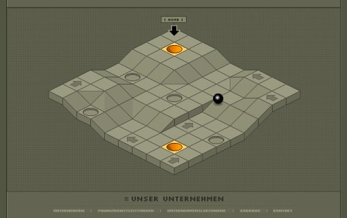

La société allemande [C.O.M.](http://com-ebusiness.de/) a fait appel aux designers de [Wireframe Studio](http://www.wireframe.co.za/) pour réaliser son site web.

Le résultat, faisant un usage intensif de Flash, est un site très beau et très ludique, mais où l'information n'est pas forcément très simple à trouver, surtout si l'on n'est pas germanophone…

