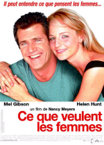

Mais qu'est-ce qu'elle pensent vraiment, les femmes, justement ?

{.onethird}

C'est vrai quoi, le film [What Women Want](http://www.whatwomenwantmovie.com/) a beau avoir été réalisé par une femme et écrit par un homme et deux femmes, comment être sûr que c'est bien là ce que pensent les femmes, que ce n'est pas un n-ième [délire](http://www.whatwomenwant.com/) de macho qui veut se donner bonne conscience ?

Ce serait dommage en outre, si tout ce que l'on est censé découvrir dans le film était vrai, il n'y aurait plus de mystères. Sans doute est-ce pour cela que l'on n'apprend justement rien par rapport aux déjà nombreux films censés nous en apprendre plus… :)

A part cette interrogation philosophique, je dois avouer que Mel Gibson et Helen Hunt s'en sortent à merveille, tout comme les nombreux seconds rôles essentiellement féminins, et que le divertissement est bien présent, même s'il s'essoufle sur la fin au profit d'une histoire romantique bien trop classique.

Enfin bon, je suis bon public en général pour ce genre de film, on ne se refait pas…

Allez, juste pour la route, une petite réplique de Nick Marshall, le personnage interprété par Mel Gibson, avant qu'il ne sorte du côté obscur : "What's the difference between a wife and a job ? After 10 years a job still sucks." Très fin, non ?
