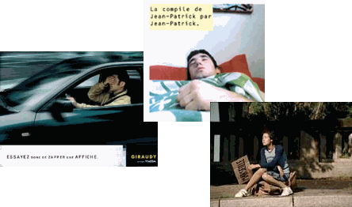

Moi je…

Après la fameuse campagne "Jean-Patrick" (James-Christopher Kendi de son vrai nom) de l'Union de la Publicité Extérieure (réalisée par Alice), les publicistes s'en donnent à coeur joie pour nous (se ?) montrer combien ils sont importants.

En témoignent [Giraudy](http://www.giraudy.fr/), avec les affiches qu'on ne peut pas zapper, et [Dauphin](http://www.dauphin-affichage.com/), avec une pub télévisée mettant en scène des autostoppeurs.

Le problème de la campagne Giraudy, même si elle est novatrice pour cet univers, c'est qu'elle est forcément destinée aux annonceurs, c'est à dire un public restreint, et non aux consommateurs, car le slogan "essayez donc de zapper une affiche" montre bien la dictature imposée par ce type de support qui nous envahit de plus en plus…

A noter la sortie chez Warner d'une compile "Jean-Patrick" qui rassemble les tubes préférés de "JP" dont Village People, Earth Win and fire ou Patrick Juvet, et en prime la chanson de Jean-Patrick, imaginée encore par Alice.

Vous pourrez découvrir d'autres infos sur la publicité avec [Stratégies Online](http://www.strategies-online.com/), [ToutSurLaCom.com](http://www.toutsurlacom.com/) (le site de Christian "Culture Pub" Blachas) et un [dictionnaire de la communication publicitaire](http://www.ucad.fr/pub/virt/univers/dicopub/).
