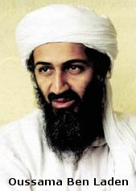

Vrai responsable ou bouc émissaire facile ?

Que ce soient des responsables américains (sous couvert d'anonymat) ou des journalistes, ceux qui forgent l'opinion public occidental semblent majoritairement d'accord pour dire que Oussama Ben Laden est le responsable de ces attentats d'une échelle inégalée.

{.onethird }

Oussama Ben Laden est un milliardaire saoudien exilé en Afghanistan. Il est considéré comme l'un des terroristes les plus importants dans le monde, au point de faire partie du ["top ten" des personnes recherchées le plus activement par le FBI](http://www.fbi.gov/wanted/topten). Il aurait notamment été lié à l'attentat qui avait déjà eu le World Trade Center pour cible en 1993. Il aurait été formé aux techniques utilisées par les commandos d'élite et les terroristes par l'armée saoudienne et au moins en partie par la CIA.

De plus, des journalistes affirment qu'il aurait annoncé ces attentats il y a trois semaines, parlant d'une "attaque sans précédent contre les intérêts américains, en raison du soutien de Washington à Israël".

Voici donc un responsable tout désigné.

Cependant, le gouvernement afghan mené par les talibans, qui condamne ces attentats, déclare que Oussama Ben Laden n'a pas les moyens d'une telle action, et lui même aurait nié son implication.

Pourtant, on apprend que les terroristes kamikaze n'auraient été armés que de simples couteaux et cutters, donc la détermination totale d'une poignée de partisans semble être le seul prix qu'il y ait eu à payer pour le commanditaire.

Donc Oussama Ben Laden peut très bien être le responsable, mais tout autre groupe ayant quelques envies d'attentats contre les Etats-Unis aussi…

Reste qu'il est plus pratique médiatiquement d'avoir une cible pour focaliser la colère des victimes que de rester dans l'expectative.

Finalement, quelles que soient les horreurs déjà réalisées par qui que ce soit, l'urgence est dans la mesure plutôt que dans la colère destructrice irréfléchie.

Espérons que George W. Bush et ses conseillés sauront attendre les résultats de la nécessaire enquête avant de punir pour ce crime un relatif innocent. Cela n'est pas sûr puisque CNN annonce déjà des bombardement sur Kaboul, capitale de l'Afghanistan, mais le gouvernement américain nie en être responsable…

Espérons alors que les "frappes chirurgicales" ont été améliorées, s'il faut malheureusement en arriver là.

Heureusement, je ne suis pas le seul à penser ça, comme l'indique cet [article de l'AFP](http://fr.news.yahoo.com/010912/1/1qhyd.html).

Sources :

- [Ben Laden soupçonné](http://www.lemonde.fr/dh/0,5987,3222--5662190,00.html) ([Le Monde interactif](http://www.le-monde.fr/))
- [La menace Ben Laden, selon "Newsweek"](http://www.lemonde.fr/article/0,5987,3216-2771-146962-,00.html) ([Le Monde interactif](http://www.le-monde.fr/))
- ["Oussama Ben laden ne peut faire cela"](http://www.liberation.fr/flash/newyork/revendications.html) ([Libération](http://www.liberation.fr/))
- [Les chefs d'accusation retenus contre Oussama Ben Laden](http://usinfo.state.gov/regional/af/security/french/f0120605.htm) ([Département d'Etat américain](http://usinfo.state.gov/francais/homepage.htm))
- [Oussama ben Laden, ennemi juré de l'Amérique, héros de certains musulmans](http://fr.news.yahoo.com/010912/1/1qhq5.html) (AFP)
- [Un point peu connu de la règlementation de la FAA autorise les passagers à porter des couteaux](http://fr.news.yahoo.com/010912/5/1qhm9.html) ([Associated Press](http://www.ap.org/))
- les média traditionnels : [LCI](http://www.lci.fr/), [CNN](http://www.cnn.com/),…
