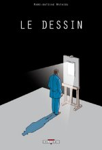

{.onethird}

Marc-Antoine Mathieu est né en 1959 à Anthony. Il a étudié à l'Ecole des Beaux Arts d'Angers avant de créer, toujours à Angers, l'agence de graphistes-scénographes [Lucie Lom](http://www.lucie-lom.fr/) spécialisée dans la création d'expositions.

En 1987, il débute sa carrière BD avec *Paris-Mâcon*, avec son frère Jean-Luc, édité par Futuropolis.

Retrouvez sa [biographie complète](http://www.editions-delcourt.fr/catalogueauteur.php3?id=90) chez Delcourt.

Il débute sa célèbre série *Julius Corentin Acquefacques, prisonnier des rêves* en 1989 avec l'album *L'Origine*. Ce premier titre le propulse au devant de la scène avec de nombreux prix, et les suivants confirmeront son talent. Dans la série *Julius Corentin Acquefacques, prisonnier des rêves* éditée par [les éditions Delcourt](http://www.editions-delcourt.fr/) se trouvent donc les 4 titres suivants :

| Titre              | Couverture       |
|--------------------|------------------|
| L'Origine          |  |
| La Qu…             |  |
| Le Processus       |  |
| Le Début de la fin |  |

On note très rapidement dans l'oeuvre de Marc-Antoine Mathieu des influences en provenance de Kafka pour les petites absurdités, de Peeters et Schuiten pour le dessin noir & blanc et les ambiances étranges,…

Après 5 ans d'absence, Marc-Antoine Mathieu revient à la BD en mars 2000, toujours chez Delcourt, avec *Mémoire morte*, une oeuvre plus noire, moins ludique, mais tout aussi passionnante.

Il publie ensuite fin 2001 son dernier titre à ce jour, *Le Dessin*, dont vous pouvez lire une critique dans [Chronic'art](http://www.chronicart.com/livres/livres_bd.php3?id=7149).

Parmis ses autres oeuvres, on trouve à l'Association :

- La Mutation
- Le Coeur des ombres

et aux Éditions Autrement :

- L'Ascension (in Le Retour de dieu, collectif)

Enfin, si vous passez à Angoulême, vous pourrez retrouver [la dalle de Marc-Antoine Mathieu](http://www.cnbdi.fr/gd_public/parvi/Dalle002.htm) sur le [parvis des stars](http://www.cnbdi.fr/gd_public/parvi/BATPARV.HTM) du [Centre National de la Bande Dessinée et de l'Image](http://www.cnbdi.fr/).
