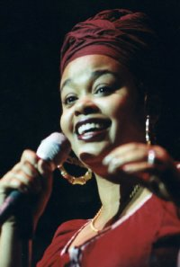

Lundi 25 février 2002, l'Elysée Montmartre.

Je ne suis pas à priori grand fan de ce type de musique qu'on nomme R&B (prononcer *ar ène bi*), qui n'évoque pas grand chose pour moi si ce n'est une n-ième tentative d'enfermer des artistes dans un [cadre commercial](http://www.amazon.com/exec/obidos/tg/browse/-/39/phpheaven) souvent trop étriqué.

Pourtant, je découvre depuis peu certains des artistes qui y sont catalogués. Je prend par exemple plaisir à écouter [Macy Gray](http://www.amazon.com/exec/obidos/tg/stores/artist/glance/-/183508/phpheaven), grâce à [Fatboy Slim](http://www.amazon.com/exec/obidos/tg/stores/artist/glance/-/90123/phpheaven)). Je ne vois par contre pas pourquoi Amazon m'indique que [Diana Krall](http://www.amazon.com/exec/obidos/tg/stores/artist/glance/-/87104/phpheaven), que j'apprécie particulièrement depuis pas mal de temps, est une artiste *similaire*…

Enfin bref, c'est par un heureux hasard qu'une amie m'a parlé de [Jill Scott](http://www.amazon.com/exec/obidos/tg/stores/artist/glance/-/207808/phpheaven) et de son passage à Paris en février. Intéressé, je me suis empressé de chercher des infos et d'écouter l'album [Who Is Jill Scott?](http://www.amazon.com/exec/obidos/ASIN/B00004UARR/phpheaven). L'ayant bien apprécié, je me suis laissé tenté par l'idée de ce concert d'un nouveau genre pour moi, mais en terrain connu, le fameux [Elysée Montmartre](http://www.elyseemontmartre.com/).

Arrive donc ce fameux lundi 25 février 2002, concert à 19h30 (dur quand on bosse régulièrement jusqu'à 20h). Suite à un set plutôt sympa d'un DJ dont le nom ne figure malheureusement pas sur le billet, mais qui a la bonne idée de passer notamment du DJ Cam du meilleur cru, la tension monte, et les musiciens arrivent sur scène. Ces musiciens, rassemblés sous le nom Fatback Taffy, assurent déjà bien le spectacle en se répondant avec talent avec leurs guitare, basse, batterie et percussions. Un trio de choristes elles-mêmes très douées individuellement accompagne le dispositif.

Après cette petite intro strictement musicale, Jill Scott arrive sur scène. Je ne l'ai jamais vue, même en photo, mais elle ressemble clairement à une diva, elle en a la prestance, et sa présence suffit à animer la salle.

Entre chaque chanson, Jill explique quelles sont ses inspirations, comment elle est devenue chanteuse, pourquoi elle parle d'amour, de couple, de sexe, de tolérance et autres sujets qui lui sont chers. Rien qu'en racontant ses diverses expériences, elle fait monter la chaleur et l'émotion.

Durant les chansons, les corps se trémoussent dans la salle, le public ne fait qu'un, toutes origines confondues, la musique fait de nous des pantins, les sourires sont sur tous les visages.

En sortant de ce concert, impossible de ne pas remarquer les mines réjouies de tout le public, c'était vraiment un grand concert, comme on en voit peu.

Pour retrouver un peu de l'ambiance de ce concert, il est possible d'écouter le double album live [Experience: Jill Scott](http://www.amazon.com/exec/obidos/ASIN/B00005R5V2/phpheaven) qui reprend notamment des extraits d'un concert au Constitution Hall de Washington D.C.

Je vais donc me pencher plus curieusement sur le R&B, il doit bien y avoir d'autres pépites du type de Jill Scott, il suffit maintenant de les débusquer.

Pour plus d'infos sur Jill Scott, consultez les pages qui lui sont consacrées sur le site de son label [Hidden Beach Recordings](http://www.hiddenbeach.com/jill_scott/).
