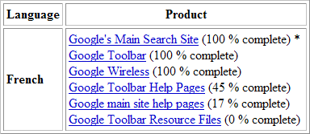

--- 
title:      "Google est trop traduit !!!" 
date: 2003-12-11 12:00:00 +02:00
lang:       fr 
tags:       [fail, humour, Google]
---

Google fait appel à ses utilisateurs pour obtenir plus facilement la traduction de toutes ses interfaces. Il semble qu'il y ait eu des excès de zèle…

En effet, il suffit d'aller sur la page de [consultation de l'état d'avancement des traductions](https://services.google.com/tcbin/tc.py?cmd=status) pour voir que pas mal de langues sont traduites à plus de 100%[^t1] !!!

Notons que les français sont plutôt bien placés, en deuxième place avec les espagnols et les italiens, juste derrière les allemands.

Je comprends donc que certains texte ont été traduits mais ne sont plus utilisés, et que donc les langues complètes sont celles qui ont un taux d'au moins 100%.

Et pourtant, il suffit de se connecter pour voir que ce n'est pas le cas du français :

Certes l'interface du site principal est intégralement traduite, ainsi que d'autres éléments, mais que signifient donc au final ces 112% ???

Si vous voulez participer, vous n'avez plus qu'à [vous insccrire](https://services.google.com/tc/Welcome.html).

[^t1]: En fait, ce n'est le cas que dans le tableau de droite, celui classé par avancement, le tableau alphabétique ne contenant aucun taux supérieur à 100%
