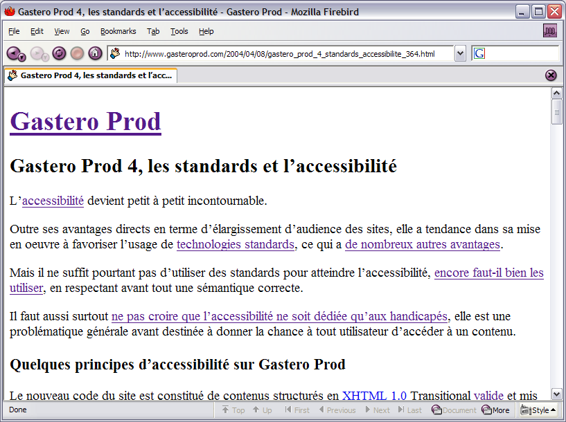

L'[accessibilité](http://www.la-grange.net/accessibilite/) devient petit à petit incontournable.

Outre ses avantages directs en terme d'élargissement d'audience des sites, elle a tendance dans sa mise en oeuvre à favoriser l'usage de [technologies standards](http://www.w3.org/QA/2003/03/web-kit.html.fr), ce qui a [de nombreux autres avantages](http://www.cybercodeur.net/weblog/presentations/standardsweb/).

Mais il ne suffit pourtant pas d'utiliser des standards pour atteindre l'accessibilité, [encore faut-il bien les utiliser](http://www.blog-and-blues.com/2004/mars/04/Les_Precieuses_Ridicules_ou_Cathos_XHTML_et_CSS.asp), en respectant avant tout une sémantique correcte.

Il faut aussi surtout [ne pas croire que l'accessibilité ne soit dédiée qu'aux handicapés](http://www.cybercodeur.net/weblog/articles/art_20040313.php), elle est une problématique générale avant destinée à donner la chance à tout utilisateur d'accéder à un contenu.

## Quelques principes appliqués sur Gastero Prod

Le nouveau code du site est constitué de contenus structurés en [XHTML 1.0](http://www.w3.org/TR/2000/REC-xhtml1-20000126/) Transitional [valide](http://validator.w3.org/check/referer) et mis en forme à l'aide de feuilles de styles [CSS 2.0](http://www.w3.org/TR/CSS2).

Cela permet notamment d'être sûr que ceux qui ne peuvent pas  (ou ne veulent pas) exploiter les feuilles de style, peuvent tout de même consulter le site sans problème :

Mais cela n'empêche pas pour autant ceux qui en ont la capacité de profiter d'un site avec une identité graphique qui lui est propre et qui n'est pas forcément la plus minimale qui soit :

Enfin, qui dit graphisme ne signifie pas forcément contrainte sur les tailles de tous les éléments, il est tout à fait possible de laisser le choix à l'utilisateur de sa taille de police par défaut.

## Un peu d'usabilité

Des « raccourcis » clavier vous permettent d'accéder rapidement, sans utiliser votre souris, à des éléments du site :

|**Elément concerné**|**Touche**|
|Page d'accueil|a|
|Moteur de recherche|r|

Voici la procédure à employer pour utiliser par exemple la touche `a`  :

- sous Windows, avec la combinaison `alt + a`
- sous Macintosh, avec la combinaison `ctrl + a` ou `pomme + a`

## Pas de styles alternatifs

Gastero Prod ne propose pas de [feuilles de styles alternatives](http://alistapart.com/articles/alternate/).

Je préfère largement le rendre réellement accessible en laissant la possibilité à l'internaute d'utiliser un outil spécialisé ou de configurer son navigateur traditionnel.

Je ne comprends pas cette tendance actuelle de fournir une tonne de mises en pages alternatives en faisant croire que c'est là pour accroître l'accessibilité, alors que c'est surtout un moyen de montrer la compétence en CSS du développeur.

Si le site n'est pas naturellement accessible avec sa mise en page par défaut, il y a de bonnes chances pour que ce *style switcher* ne soit même pas exploitable par quelqu'un ayant cette problématique d'accessibilité.

Cela ne m'empêche pas de penser comme beaucoup que [css Zen Garden](http://www.csszengarden.com/) est très intéressant, mais je ne vois pas l'intérêt que chaque site devienne un tel laboratoire en puissance.

## Au boulot !

Cette refonte ayant permis d'enfin séparer comme il faut le contenu et le contenant, mais ayant consommé pas mal de temps, il devient nécessaire de se reconcentrer sur les contenus pour accroître la fréquence de publication !

Et si vous souhaitez être tenu au courant des publications, n'hésitez pas à exploiter le [flux RSS](/atom.xml), il est maintenant au format RSS 2.0.
