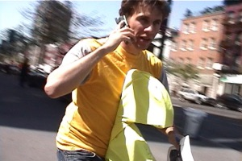

Quand de grands enfants sont nostalgiques et prennent leur ville comme espace de jeux, tout peut arriver…

Ils sont membres de l'[Interactive Telecommunications Program](http://itp.nyu.edu/), un programme de la [New York University](http://www.nyu.edu/) qui a pour vocation d'encourager ses étudiants à « créer de nouvelles formes de communication par l'exploration d'applications sociales (???), de l'informatique physique, de jeux interactifs, d'art multimédia, de sons, de vidéos et bien plus tout en mettant l'accent sur les interactions avec l'utilisateur. »[^t1]

Ceux-là n'ont pas trouvé mieux que de recréer en grandeur nature un des fleurons des débuts de l'informatique ludique, à savoir l'ancêtre Pacman !

Ils ont pris un quartier de New York comme terrain de jeux, profitant ainsi de la structure en grille si représentative de nombreuses villes américaines.

Ils ont donc naturellement appelé leur expérience [Pac Manhattan](http://pacmanhattan.com/).

Leurs moyens de connaître les positions relatives de chaque joueur sont basé sur l'utilisation de téléphones mobiles, connexions WiFi et autre logiciel développé spécifiquement pour ce besoin.

Tout cela peut être suivi par le monde entier sur Internet.

A quand une version dans Paris ?

[^t1]: Voir la [présentation complète de l'ITP](http://itp.nyu.edu/PROGRAM/overview.html)

Merci à la [Ze Liste](http://www.zewoc.com/zeliste) de [Ze WoC](http://www.zewoc.com/), toujours à l'affut de sensations !
