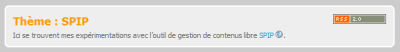

--- 
title:      "Plus de flux RSS" 
date: 2005-01-05 12:00:00 +02:00
lang:       fr 
tags:       [SPIP, RSS]
---

Vous pouvez désormais suivre avec des flux RSS dédiés les publications par thème, et les commentaires article par article.

## Les publications par thème

Vous vous dites régulièrement que vous appréciez les articles que je publie sur mes expérimentations avec SPIP, mais que vous n'avez rien à faire des autres thèmes ?

Alors profitez maintenant de flux RSS dédiés à chaque thème, avec un lien présent sur la page de chacun d'entre eux.

Voici l'exemple pour le thème «[SPIP](/tags/spip/)» :
 

Le flux RSS de ce thème possède l'URL suivante : <http://www.gasteroprod.com/rss/themes/spip/29.rss>

Et le squelette est tout simple, vous pouvez le voir là : <http://www.gasteroprod.com/design/backend_theme.html>

## Les commentaires

SPIP m'envoi automatiquement un mail dès qu'un commentaire est associé à un article, ce qui me permet de bien suivre la vie du site.

Vous avez par contre sans doute du mal à suivre les discussions qui vous intéressent si vous devez pour cela revenir régulièrement vérifier par vous-même s'il y a eu des changements.

J'ai donc mis en place des flux RSS dédiés à ces discussions, accessible via un lien présent au début de chacune de ces discussions.

Voici l'exemple pour les commentaires de l'article «[Pompez !](/2005/01/pompez.html)» :

Le flux RSS de cette discussion possède l'URL suivante : <http://www.gasteroprod.com/rss/commentaires/pompez-428.rss>

Et le squelette est lui aussi tout simple, vous pouvez le voir là : <http://www.gasteroprod.com/design/backend_commentaires.html>

Au passage, vous noterez la présence de petites photos associées à chaque message, puisqu'il est si simple d'avoir «[Des Gravatars avec SPIP](/2005/01/des-gravatars-avec-spip.html)»…
