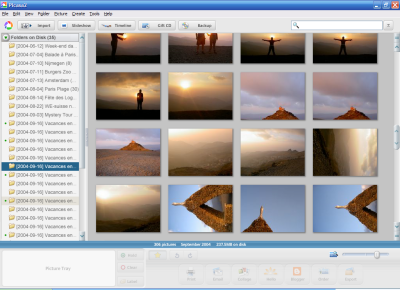
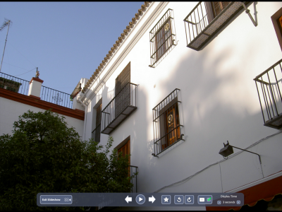

Après son rachat l'an dernier par Google, et la mise à disposition gratuite de sa version 1.6, [Picasa](http://www.picasa.com/) avait connu un succès phénoménal, malgré quelques défauts bien pénibles…

C'est maintenant corrigé avec une [toute nouvelle version 2](http://www.google.com/googleblog/2005/01/smile-and-say-cheese.html) encore meilleure, avec toujours cette simplicité d'utilisation, et ces effets - assez nouveaux pour les utilisateurs de PC - de zoom totalement progressifs.

Au menu des améliorations de cette tout autant gratuite version 2, pas mal de choses, mais surtout le respect des dossiers physiques de stockage des photos sur le PC. La version 1.6 ne pouvait se baser que sur la date de prise de la photo, ce qui avait le don de m'énerver puisque j'ai déjà l'habitude de classer mes photos dans des dossiers bien précis.

Pour découvrir toutes les fonctionnalités offertes, je vous invite à aller voir directement sur [le site de Picasa](http://www.picasa.com/), mais voici déjà un apperçu de quelques fonctionnalités :

Il y a plein d'autres fonctionnalités toutes plus épatantes les unes que les autres, je vous laisse les découvrir !

Malheureusement, l'upload direct dans [Flickr](https://flickr.com/) n'est pas encore au programme…
