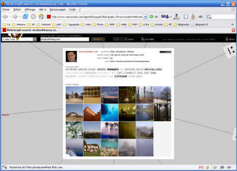

Ce qui fait le succès de [Flickr](https://www.flickr.com/), c'est non seulement ses propres services, mais aussi l'incroyable inventivité de ceux qui utilisent l'[API](https://www.flickr.com/services/api/) mise à disposition pour récupérer toutes sortes d'information par des appels de Web Services.

A vrai dire, je préparais un gros article sur Flickr et ses nombreux projets dérivés, mais le temps manque, et les choses vont très vite…

Le nouveau projet dérivé qui est impressionnant, c'est [flickrGraph](http://www.marumushi.com/apps/flickrgraph/), dont l'objectif est de représenter sur un graphe animé en flash les relations d'un utilisateur de flickr, [moi](http://www.marumushi.com/apps/flickrgraph/flickrgraph.cfm?q=nicolas%40hoizey.com) par exemple, puis les relations des relations, et ainsi de suite…

Pour chaque utilisateur, il est possible aussi de voir directement les dernières photos.

