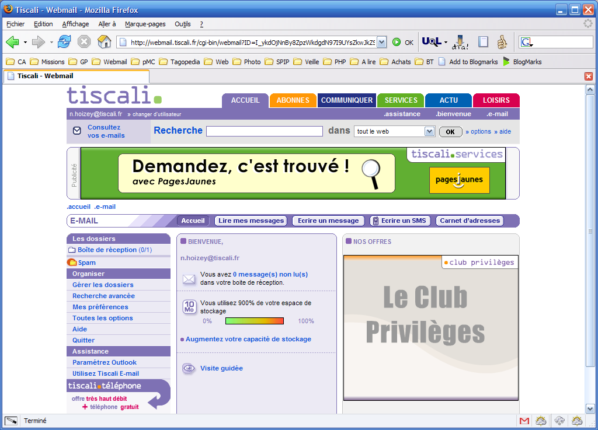
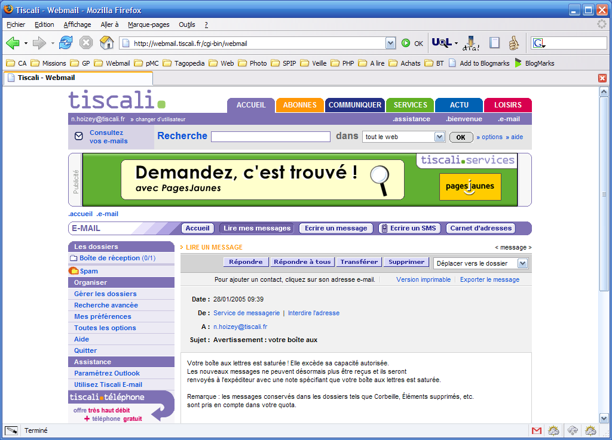

--- 
title:      "Tiscali auto explose ses quotas de mail" 
date: 2005-02-14 12:00:00 +02:00
lang:       fr 
tags:       [fail]
---

N'utilisant jamais le compte e-mail fourni avec mon accès ADSL [Tiscali](http://tiscali.fr/), je vais le vérifier quand même de temps en temps pour être sûr de ne pas exploser son quota avec plein de SPAM… et là, oh surprise !

Manifestement, j'ai bien une explosion de quota, avec **900&nbsp;% de l'espace de stockage utilisé** :

J'ai même reçu un message de Tiscali m'alertant sur ce point :

Mais justement, quand j'essaie de supprimer ce message, j'ai une erreur :

Bon, apparemment il est quand même supprimé, et j'ai gagné 100&nbsp;Mo ! Ils font des messages bien lourd chez Tiscali :

Sauf que je n'avais que ce message dans ma boîte, donc je ne vois pas trop comment gagner ces 800&nbsp;% qui restent !!!

J'avais déjà envie de quitter Tiscali pour l'ADSL, ce n'est pas ça qui va me faire changer d'avis…
