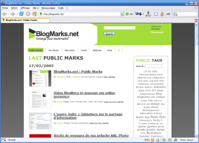
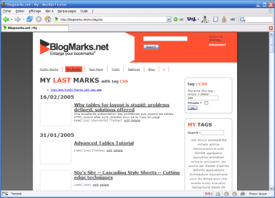

Heureux béta testeur depuis quelque temps de ce nouveau concurrent de [del.icio.us](http://del.icio.us/) développé par des français, je suis ravi de pouvoir enfin vous en parler.

[Blogmarks.net](http://blogmarks.net/), donc, est un site/outil de gestion de favoris en ligne.

Le but principal de ce type d'outil, c'est de pouvoir utiliser tous ses favoris depuis n'importe quel ordinateur ou navigateur. Mais ce que les nouveaux sites du genre apportent, c'est la possible ouverture de ces favoris au public.

Blogmarks.net propose en plus, en vrac, la gestion de tags publics et privés, une copie d'écran pour chaque site mis en favoris[^t1], un filtrage dynamique de la liste de tags quand on fait une recherche[^t2], etc.

Il ne lui manque plus, comme pour tous les systèmes de tags, qu'une bonne dose de [sémantique](/2005/02/le-web-semantique-a-nos-portes.html)…

[^t1]: A la manière de l'extension [BetterSearch](http://bettersearch.g-blog.net/) pour Firefox

[^t2]: Avec le fameux [XMLHTTPRequest](http://blogmarks.net/tag/xmlhttprequest) qui fait baver tout le monde depuis que Google a lancé en beta son [Google Suggest](http://www.google.com/webhp?complete=1&amp;hl=en)
