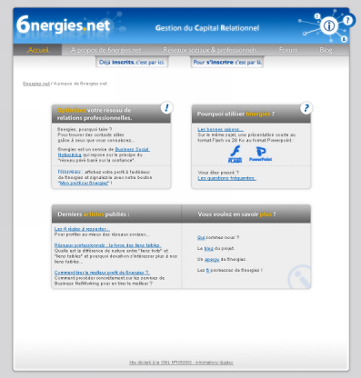

Après son lancement le 21 janvier dernier, à [12h28 exactement](http://www.6nergies.net/blog/index.php?2005/01/20/37-le-compte-a-rebour-comme-si-vous-y-etiez), [6nergies](http://www.6nergies.net/) organisait hier une [soirée *open bar*](http://www.6nergies.net/blog/index.php?2005/02/22/58-la-soiree-open-bar-de-jeudi) pour ses *beta* testeurs, dont j'ai l'honneur de faire partie.

Si vous ne connaissez pas encore 6nergies, sachez juste que c'est une plateforme en ligne de *social networking*, c'est à dire un site qui va vous permettre de créer et profiter de réseaux de contact, dans un cadre avant tout professionnel. Des équivalents déjà connus sont [LinkedIn](http://www.linkedin.com/) ou [Viaduc](http://www.viaduc.com/).

La soirée d'hier était l'occasion bien sûr de rencontrer d'autres *beta* testeurs, de concrétiser dans le monde réel ce *social networking* en marche[^t1], mais aussi de présenter l'équipe qui a développé ce site, notre filiale [Clever Age Pologne](http://pl.clever-age.com/)[^t2].

Si vous vous rendez sur [6nergies](http://www.6nergies.net/) pour la première fois, vous serez sans doute rebuté par le design, mais ne vous inquiétez pas, une prochaine version devrait vite voir le jour avec un [refonte complète](http://www.6nergies.net/blog/index.php?2005/02/11/52-evolution-du-graphisme-de-6nergies-suite) de celui-ci :

Je laisse [Alain Lefebvre](http://www.6nergies.net/people/1019-alain-lefebvre)[^t3] vous expliquer [pourquoi utiliser 6nergies](http://www.6nergies.net/article.php3?id_article=2), et notamment quelles sont [les 6 différences et les 6 promesses de 6nergies](http://www.6nergies.net/article.php3?id_article=1).

Allez, n'hésitez plus, [inscrivez-vous](http://www.6nergies.net/application/pub_invitation.php) [^t4] et créez vos 6nergies !

[^t1]: En [distribuant ses cartes de visite](http://stephane.etsoncar.net/news/58.shtml) notamment

[^t2]: En utilisant notamment [SPIP-Agora](http://spip-agora.clever-age.org/) et [le framework Horde](http://www.horde.org/)

[^t3]: Notamment ancien créateur et directeur technique de SQLI

[^t4]: Ou demandez-moi de vous inviter, ce qui sera encore mieux, puisque vous pourrez tout de suite profiter de mon propre réseaux
