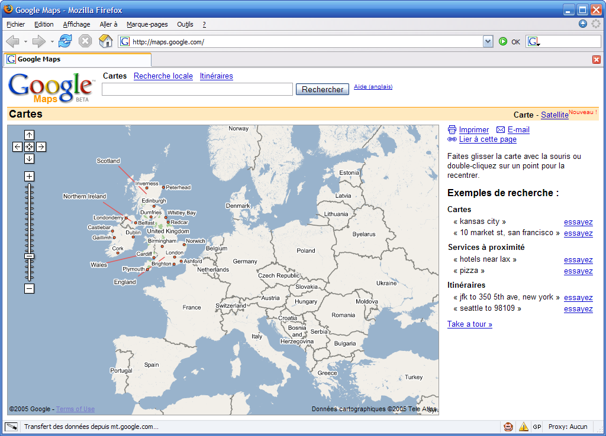

Ca y est enfin, [Google Maps](http://maps.google.com/) commence progressivement à être accessible au monde entier, et non plus uniquement aux Etats-Unis et au Royaume-Uni. Mais à quel prix ?

Une petite coquille s'est glissé dans la carte d'Europe proposée par Google, la Belgique et les Pays-Bas sont inversés !!!

Il est vrai que vu depuis l'autre côté de l'Atlantique, la différence est négligeable…

Enfin bon, je dois au moins remercier Google et les gens de [Geobloggers](http://www.geobloggers.com/), qui me permettent de montrer progressivement - et [très facilement](https://www.flickr.com/groups/topic/47132/) - des cartes du monde avec les lieux où je prends [mes photos postées sur Flickr](https://www.flickr.com/photos/nicolas-hoizey/) :

- En [Europe et Egypte](http://www.geobloggers.com/index.cfm?lat=40&lon=10&username=Nicolas+Hoizey&range=180&t=k)
- Aux [Etats-Unis](http://www.geobloggers.com/index.cfm?lat=40&lon=-85&username=Nicolas+Hoizey&range=180&t=k)
