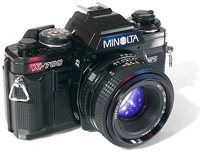

A l'heure où l'argentique est en grosse perte de vitesse, notamment au niveau de la production de pellicules, papiers et chimies, voilà qu'un des acteurs majeurs de la photographie abandonne tout, y compris son activité numérique !

{.logo}

C'est dans un [long communiqué](http://kmpi.konicaminolta.us/eprise/main/kmpi/content/cam/cam_News/cam_NewsDetail/Camera_Business_Withdraw?header=aboutus), publié ce 19 janvier, que [Konica Minolta a annoncé son retrait de l'activité liée aux appareils photographiques](http://www.zone-numerique.com/news-photo-numerique-442.htm).

[Et](http://audioblog.fr/archives/2006/01/19/konica-minolta-arrete/) [tout](http://www.zdnet.fr/actualites/informatique/0,39040745,39304325,00.htm) [le monde](http://www.lemonde.fr/web/article/0,1-0@2-3234,36-732916@51-732051,0.html) [en](http://standblog.org/blog/2006/01/24/93114618-en-vrac) [parle](http://www.liberation.fr/page.php?Article=352465)…

C'est donc un des gros acteurs du domaine qui jette l'éponge, principalement parce que la rentabilité est très faible, surtout comparée à celle d'activités moins grand public et plus spécialisées comme les optiques, les capteurs, les afficheurs, l'imagerie médicale, etc.

Konica Minolta travaillait depuis quelque temps avec Sony sur l'élaboration d'un appareil Reflex censé concurrencer les Canon EOS 350D, Nikon D70s et autres Olympus E-500…

## Quel avenir ?

Toute l'activité photo de KM devrait être reprise par Sony, qui annonce tout simplement vouloir capter [un quart du marché](http://today.reuters.fr/news/newsArticle.aspx?type=technologyNews&storyID=2006-01-20T112219Z_01_MAL040916_RTRIDST_0_OFRIN-SONY-PHOTO-20060120.XML). Les futurs appareils Sony devraient notamment reprendre le système de fixation d'objectifs des Konica Minolta Dynax, assurant une pérennité aux possesseurs de ce type d'objectif.

## Et mon matos alors ???

Voilà déjà longtemps que j'hésitais à faire réparer mon bon vieux [Minolta X-700](http://www.mir.com.my/rb/photography/hardwares/classics/minoltax700/)[^1], il va falloir que je me dépêche, sinon je n'aurais plus le choix. J'ai récupéré ce boitier argentique de référence — ainsi que plusieurs optiques — il y a quelques années après que mes parents se sont acheté un reflex argentique un peu plus moderne, mais je n'ai malheureusement pas pris assez le temps de l'utiliser, je le regrette de plus en plus, même si j'ai largement de quoi m'amuser maintenant avec mon [Canon EOS 350D](https://www.flickr.com/photos/nicolas-hoizey/76046485/in/set-165968/)…

Pour ce qui est de mon premier boitier numérique, un excellent [Konica KD-400 Z](http://www.nomatica.fr/photo/kd400zFR.htm), il a déjà subit pas mal d'outrages depuis 2002[^2], et il continue pourtant fièrement à fonctionner. J'espère que ça va durer, d'autant qu'[il n'a clairement pas à rougir de n'être qu'un petit automatique, vu les résultats](https://www.flickr.com/photos/nicolas-hoizey/2704862/in/set-685912/) !

<html> </html>
**MAJ du 24/01 :** Ce que je n'avais pas vu, il y a quelques jours, c'est que [Nikon a décidé de se concentrer sur le numérique](http://www.nikon.co.uk/press_room/releases/show.aspx?rid=201), et seul l'argentique pro de référence F6 sera toujours commercialisé en Europe.

[^1]:  [Ken Rockwell](http://www.kenrockwell.com/) en dit tout simplement : «*[This is Minolta's best mass market manual focus camera, ever.](http://www.kenrockwell.com/minolta/700.htm)* »

[^2]: Dont un petit bain dans l'eau salée de la Mer Rouge !
