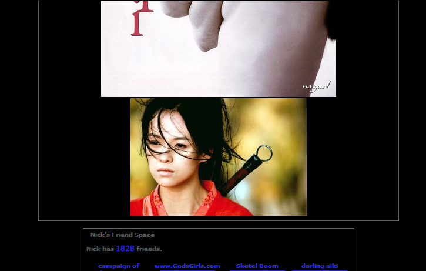

--- 
title:      "Halte au vol de bande passante !" 
date: 2006-03-27 12:00:00 +02:00
lang:       fr 
tags:       [fail, hosting, RewriteRule]
---

Certains individus peu scrupuleux n'hésitent pas à prendre les sites web des autres pour des espaces de mise à disposition de bande passante. Plusieurs images de mon site sont ainsi utilisées par différentes personnes sur d'autres sites, en appelant directement l'URL de mon site et non en recopiant le fichier.

Par exemple, la photo de Zhang Ziyi que j'ai mis dans mon article sur le film « [Hero](/2003/10/hero.html) » :

"){.onethird}

En consultant les *logs* de consultation de mon serveur HTTP Apache, je me suis rendu compte qu'elle est reprise sur différents sites, dans le profil d'internautes peu scrupuleux.

Sur [Fractal](http://www.fract.org/) par exemple, dans [le profil d'une certaine « Mei Lin »](http://www.fract.org/game/popup/popup.php?cazid=18740&caztyp=1) :

{.onehalf}

Dans les forums de [El Otro Lado](http://www.elotrolado.net/), dans [la signature d'un certain « Evil Mask »](http://www.elotrolado.net/showthread.php?s=e9641aba363ea6b5f31c0d7ac2a5d199&postid=1704174210#post1704174210) :

{.onehalf}

Bien sûr, le [furoncle](http://www.myspace.com/) MySpace n'échappe pas à la liste, avec notamment [le profil d'un certain « Nick »](http://profile.myspace.com/index.cfm?fuseaction=user.viewprofile&friendID=3871726)…

{.onehalf}

… ou encore [celui d'un certain « Sgnl>06 (Paul Fills The Void) »](http://www.myspace.com/newyorkslave) :

{.onehalf}

J'arrête là la démonstration, mais j'ai déjà relevé plus de dix autres sites sur lesquels cette unique image est réutilisée sans vergogne.

Cette photo n'est pas de moi, bien sûr, et je ne suis même sans doute pas totalement dans mon droit en l'affichant ainsi sur mon site, mais ce que je déplore surtout, c'est la quantité de bande passante ainsi détournée !

D'après les *logs* Apache, l'image a été téléchargée 321 fois vendredi 17 mars pour illustrer une page non hébergée par mon site.

Pour les techniciens, voilà comment j'ai obtenu ce résultat :

```shell
cat gasteroprod_access_log | grep zhang_ziyi.jpg | grep -v gasteroprod | grep "17/Mar/2006" | wc -l
```

L'image faisant une taille de 14748 octets, on arrive à **un vol de bande passante quotidien d'environ 4,5 Mo**. Et cela pour une seule des images qui sont « volées », je n'ose tenter un calcul global…

Heureusement, une solution existe ! [Comme l'explique simplement NiKo](http://www.prendreuncafe.com/blog/2006/03/19/417-note-en-passant), il « suffit » d'empêcher les méchants de voler la bande passante, en interdisant l'usage d'images du site à partir d'autres sites. Via les [*Rewrite Rules* d'Apache](http://httpd.apache.org/docs/1.3/mod/mod_rewrite.html), en l'occurance.

La solution de NiKo ne s'intéresse qu'au [furoncle](http://www.myspace.com/) MySpace, donc il est nécessaire d'adapter la règle décrite.

Malheureusement, il est impossible de généraliser la règle à tout site externe, car les images deviendraient alors invisibles dans les aggrégateurs de flux de syndication en ligne tels que [Bloglines](http://www.bloglines.com/) ou [FeedLounge](/2006/01/feedlounge-s-ouvre-enfin-au-public-impatient-et-enterre-directement-ses-concurrents.html).

Voici donc ma règle pour l'instant, si je la limite à trois domaines :

```apacheconf
RewriteCond   %{HTTP_REFERER} ^.*(myspace|elotrolado|fract)\.[^/]+/.*$ [NC]
ReWriteRule   .*\.(gif|png|jpg|jpeg)$     - [F]
```
