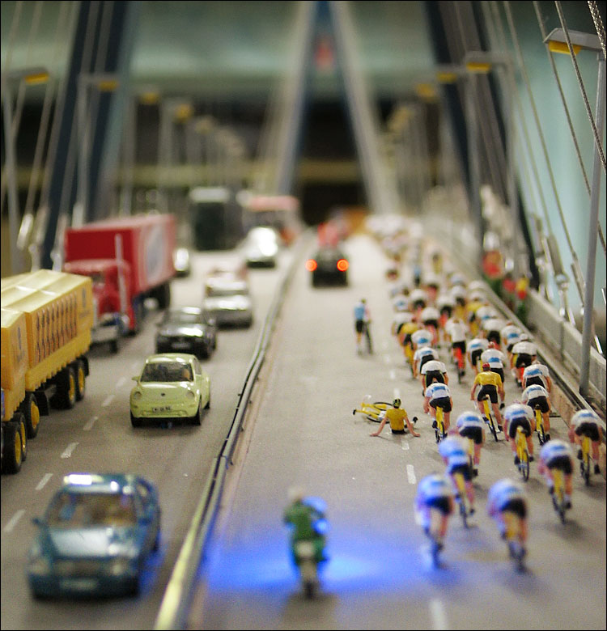

Vous connaissez peut-être [France Miniature](http://www.franceminiature.com/), un sympatique parc d'attraction qui présente en modèles réduits réalistes les plus célèbres monuments de France.

L'Allemagne s'est aussi dotée d'un parc d'attraction de ce type, [Miniatur Wunderland](http://www.miniatur-wunderland.de/), qui s'intéresse lui au monde entier… et à un public plus large.

# Au départ, de fausses miniatures

Une mode actuellement très en vogue sur [Flickr](/tags/flickr/)[^1] consiste à réaliser[^2] de fausses photos de modèles réduits à partir de photos d'éléments de grandeur normale. Cette pratique est appelée *tilt-shift miniature fakes*, du nom des objectifs spéciaux qui permettent d'obtenir le même résultat sans manipulation informatique, et a donné lieu à la création d'un groupe [Tilt-shift miniature fakes](https://www.flickr.com/groups/59319377@N00/). Un second groupe est même né pour mettre en avant les meilleurs éléments, [Top 20 Fake Tilt-Shift](https://www.flickr.com/groups/top20faketiltshift/).

Si vous voulez vous lancer vous aussi, voici [un bon tutoriel pour Photoshop](http://recedinghairline.co.uk/tutorials/fakemodel/) proposé par Christopher Phin.

# Et les vraies miniatures, dans tout ça ?

Bref, c'est en parcourant Flickr à la recherche des meilleurs exemples de ces manipulations que je suis tombé sur cette photo intitulée *[miniatur wunderland](https://www.flickr.com/photos/wvs/107108594/)* :

Croyant au départ avoir affaire à un nouvel exemple de manipulation, je me suis en fait rendu compte qu'il s'agit tout simplement d'une vraie photo de maquette, qui est du coup plutôt réaliste !

J'ai un peu creusé le sujet en cherchant [les photos les plus intéressantes sur ce Miniatur Wunderland](https://www.flickr.com/photos/tags/miniaturwunderland/interesting/) que je venais de découvrir.

# Une petite dose de fun

J'ai ainsi découvert que les allemands ont de l'humour, avec [quelques](https://www.flickr.com/photos/barttc/51132903/) [exemples](https://www.flickr.com/photos/barttc/51133175/) [sympathiques](http://www.freakydog.de/galerie/bild/166/), dont ce [Bestzt](https://www.flickr.com/photos/effpunkt/88967949/) :

# Quand le réalisme dépasse les limites du bon goût

Mais j'ai aussi découvert un type de miniatures bien particulier, à priori plutôt destiné aux adultes, comme ce [Miniatur Wunderland IX](https://www.flickr.com/photos/gullideckel/48541516/) :

Et voici d'[autres](https://www.flickr.com/photos/gullideckel/48541518/) [exemples](https://www.flickr.com/photos/gullideckel/48541517/) tout aussi [explicitement](https://www.flickr.com/photos/barttc/51132448/) destinés aux [adultes](https://www.flickr.com/photos/oandreas/1145708/).

Si de tels éléments peuvent faire sourire les adultes, et surtout les faire venir, comment ont-ils pu apparaître dans un parc d'attraction où la population de visiteurs est majoritairement composée d'enfants ?

Est-ce que ceux-ci se rendent compte, au moins partiellement, de ce qu'ils voient ? Comment réagissent leurs parents ?

Etonnament, ou ne sachant pas comment bien chercher, je n'ai trouvé aucun article en ligne qui parle de ce sujet, il faudrait que je révise mes lointains cours d'allemand peut-être…

**MAJ du 31 mars :** Fred Cavazza s'interroge justement ces jours-ci sur [les dérives du marketing viral](http://www.fredcavazza.net/index.php?2006/03/29/1111-les-derives-du-marketing-viral) vers toujours plus d'excès, allant même maintenant jusqu'à la pornographie pour vendre des vêtements. Jusqu'où sont prêt à aller les vendeurs ?

[^1]: Et [même Boing Boing en a parlé](http://www.boingboing.net/2006/02/27/fake_tilt_shift_phot.html) !

[^2]: Avec Photoshop ou The Gimp
