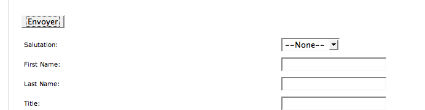
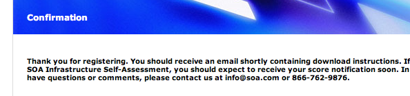

La société [SOA Software](http://www.soa.com/), comme son nom l'indique, est un éditeur de logiciel appartenant à la grande tendance [SOA](http://www.clever-age.com/veille/blog/tags/soa/)[^1] actuelle. Mais peut importe, les défauts d'ergonomie que l'on peut relever sur leur site ne sont pas liés à leur activité.

[^1]: *Services Oriented Architecture*

Les défauts en question se trouvent — comme pour [CashStore.fr](/2006/11/ergonomie-a-revoir-cashstore-fr.html) dont j'ai parlé précédemment — dans le [formulaire de création de compte](http://www.soa.com/index.php/section/registration/) permettant d'obtenir leurs livres blancs.

## Et d'un

Le premier défaut, c'est un bouton « Envoyer » qui est situé au début du formulaire, ce qui peut inciter à le presser alors que cela n'a pas de sens tant que le formulaire n'est pas rempli :

Heureusement, un second bouton identique se trouve en fin de formulaire, sa position logique.

## Et de deux

Bête comme je suis, j'ai justement cliqué sur ce premier bouton, et j'ai eu la surprise de tomber sur un message confirmant mon inscription, et notamment que j'allais recevoir un e-mail de confirmation, alors que je n'ai rien rempli du tout, donc notamment pas mon adresse e-mail !

Il n'y a donc aucun contrôle des champs saisis, ce qui finalement est assez logique puisque aucun n'est indiqué comme obligatoire…

## Et de trois !

Bon, je suis raisonnable, donc je rempli vraiment le formulaire. Là, je tombe au bout d'un moment sur un champ qui me demande depuis où je m'inscrit (*registration source*)… ah mais non, on me demande en fait de ne pas le remplir :

Déjà que le formulaire est un peu costaud avec tous ses champs, alors en mettre qui ne doivent en fait pas être remplis, c'est vraiment du grand n'importe quoi.

En fait, vu que bien souvent je passe d'un champ à l'autre pour les remplir sans forcément faire bien attention aux labels, je suis arrivé sur celui-ci, j'ai déroulé la liste, et j'ai bien été surpris de ne trouver qu'un choix, présélectionné qui plus est :

En fait, ils ont visiblement préféré indiquer de ne pas faire de choix plutôt que masquer le champ, drôle de façon de simplifier la vie de l'Internaute…

Au final, voilà un formulaire qui pourrait vraiment être très simplement amélioré, on se demande comment ils ont pu arriver à un résultat si dénué de bon sens.
