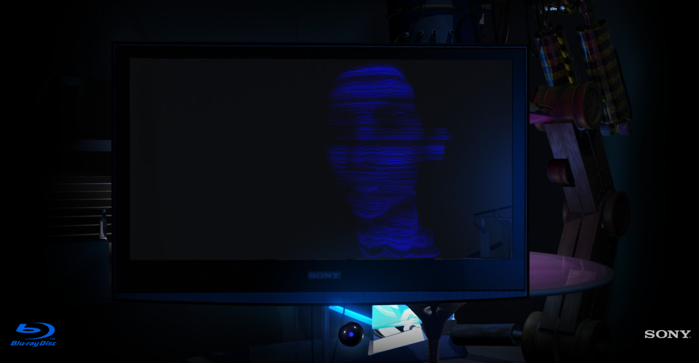

Alors que la [bataille entre les formats de DVD HD Blu-Ray et HD-DVD](http://www.marketing-planet.com/articles/dvd-marketing-war-sonyaeurotms-blu-ray-against-toshibaaeurotms-hd-dvd-91.html) est loin d'être terminée[^i1], Sony lance une nouvelle campagne publicitaire en ligne, avec une pub de toute beauté, que j'ai hâte de voir en image et son HD.

[^i1]: Même si le Blu-Ray semble bien profiter de la PS3, malgré son prix encore trop élevé

Voici cette fameuse pub[^1] :



Cette pub est aussi l'occasion pour Sony de lancer son [Musée de la Base Résolution](http://www.blu-ray.sony-europe.com/)[^2] qui doit tout faire pour vous convaincre de passer à la HD, et plus particulièrement au Blu-Ray, bien sûr.

[^1]: Désolé pour la faible qualité, la [version fournie par Sony](http://www.blu-ray.sony-europe.com/player/player.php?lang=fr) se lance automatiquement et le code HTML proposé est pourri…

[^2]: *Museum of Low Resolution (MoLR)* en anglais
