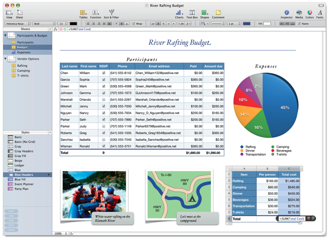

Si vous avez plus d'une heure à y consacrer, je vous conseille de regarder [la dernière *keynote* de Steve Jobs](http://www.apple.com/quicktime/qtv/keynote/)[^i1], où il a présenté les nouveautés Apple. Au programme, un nouvel iMac encore plus beau et puissant, la nouvelle version de iLife avec de vraies belles évolutions, un nouveau tableur dans iWork, etc.

[^i1]: Uniquement en *streaming* pour l'instant, malheureusement

## Le nouvel iMac

Sans doute attiré par la grande mode actuelle des écrans télé LCD et Plasma, le [nouvel iMac](http://www.apple.com/imac/) quitte le design sobre blanc pour [un look plus voyant](http://www.apple.com/imac/design.html) avec un [écran *glossy* cerclé de noir](http://www.apple.com/imac/technology/display.html).

La coque passe en aluminium, ce qui donne à Steve l'occasion de dire qu'Apple favorise ainsi le [recyclage](http://www.apple.com/environment/). A quand des MacBook non pro bien classe en alu, alors ? 😉

Cet iMac s'accompagne évidemment d'un nouveau clavier assorti, en aluminium lui aussi, et surtout extrêmement réduit en épaisseur par rapport au précédent. Il est fait de touches similaires à celles des portables MacBook, il va falloir que certains s'y habituent.

Un clavier sans fil bluetooth est lui aussi disponible afin de réduire encore le nombre de cables — plus qu'un seul pour le courant, finalement, si vous avez aussi une souris sans fil.

Comme vous pouvez le voir, ce clavier est fortement inspiré de celui des MacBook.

Par contre, de manière totalement incompréhensible pour moi, le positionnement des touches n'est pas le même que sur les MacBook — non pro en tout cas, je ne connais pas les claviers des MacBook Pro — donc il va falloir faire une gymnastique intellectuelle pénible si l'on passe régulièrement de l'un à l'autre.

Par exemple, les touches de fonction permettant de lancer Exposé ou le Dashboard — qui gagnent au passage des illustrations significatives — sont situées à gauche, alors qu'elles sont à droite sur le MacBook :

Par conséquent, les touches de réglage du son prennent la place laissée vacante à droite, alors qu'il aurait été sans doute plus simple et cohérent de garder le même positionnement :

Il y a ainsi plusieurs autres touches qui ont changé de position, j'aimerai bien connaître les motivations qui ont conduit à ce que j'estime être une erreur d'ergonomie bien étrange de la part d'Apple.

Un autre changement non négligeable sur ce nouveau clavier, c'est ni plus ni moins que ma **disparition de la célèbrissime pomme** ! Oui, vous avez bien lu, la pomme n'est plus là, elle est remplacé par un bien plus pragmatique mais moins sympathique label « Command » :

## iLife '08

[iLife](http://www.apple.com/ilife/), la suite multimédia d'Apple, reçoit quelques nouveautés bienvenues, dont essentiellement pour ce qui m'intéresse dans iPhoto et iMovie.

### iPhoto

La nouvelle version de [iPhoto](http://www.apple.com/ilife/iphoto/) sait enfin gérer la navigation par date, et contrairement à ce que dit Steve Jobs, non, ce n'est pas révolutionnaire, presque tous les autres logiciels de catalogage de photos le font !

Là où Apple innove, c'est dans la notion d'album lié à une date, ou plutôt à un événement. Il est ainsi possible de rassembler les photos d'un même événement dans un album particulier. La création est automatique pour toutes les photos prises à une même date, et il est ensuite possible de diviser ou ressembler simplement les albums.

Une autre nouveauté très intéressante est la navigation dans les photos d'un album tout simplement en déplaçant la souris le long de sa vignette, sans avoir à l'ouvrir complètement ! Apple parle ici de « *skimming* ».

Apple améliore enfin le partage de photos en ligne en ajoutant des galeries très Web 2.0[^1] à .Mac et en augmentant la capacité de stockage à 10 Go contre 1 Go actuellement. Voici d'ailleurs [un exemple de galerie](http://gallery.mac.com/emily_parker), où l'on peut voir que même en ligne le *skimming* fonctionne.

### iMovie

C'est [iMovie](http://www.apple.com/ilife/imovie/) qui fait l'objet de la plus importante mise à jour, a tel point que cette nouvelle version ne reprend rien de l'ancienne. Un ingénieur Apple aurait tellement luté avec l'ancienne version pour monter un film qu'il aurait développé pour son propre usage cette nouvelle version, avant qu'elle soit retenue comme nouvelle solution iMovie d'Apple. J'en ai presque la larme à l'oeil…

Toujours est-il que cette nouvelle version remet enfin à plat la visualisation et le montage vidéo en proposant une interface simplifiant grandement le choix de sections de vidéos existantes, que l'on parcours à la manière des photos dans iPhoto, avec la dimension temporelle supplémentaire permettant de « zoomer » plus ou moins sur la vidéo, c'est à dire d'en voir plus ou moins d'extrait côte à côte.

Comme on parcours un album dans iPhoto en déplaçant la souris sur sa vignette, on peut ici [naviguer dans la vidéo](http://www.apple.com/ilife/imovie/#playing) de façon extrêmement simple.

La [démo de iMovie '08](http://movies.apple.com/movies/us/apple/mac/ilife/2007/tour/apple_ilife08_imovie_20070807_iref.mov) est bluffante de simplicité, j'ai hâte d'y toucher !

Outre le partage de vidéos via .Mac, iMovie permet aussi d'exporter directement vers [YouTube](http://www.youtube.com/), signe supplémentaire de rapprochement entre Apple et Google[^2].

## iWork '08

Côté [iWork](http://www.apple.com/iwork/), la suite bureautique d'Apple, on voit enfin apparaître un tableur au côté du traitement de texte Pages et du logiciel de présentation Keynote.

### Numbers

Ce tableur prend le nom tout simple de Numbers, et met particulièrement l'accent sur la présentation tout comme Pages et Keynote.

Certaines fonctionnalités sont de plus simplifiées par rapport à ce qui se fait chez la concurrence, notamment au niveau des formules.

## Et le reste

Apple a aussi mis à jour d'autres éléments de ses gammes logicielles et matérielles sans pour autant que Steve Jobs en fasse état lors de sa Keynote.

Le plus intéressant est sans doute que le [Mac mini](http://www.apple.com/macmini/) est enfin mis à jour avec les derniers processeurs Intel, il était temps !

Il ne reste plus qu'à attendre octobre pour la sortie de Leopard, et il sera possible d'acquérir une nouvelle machine avec bien sûr Leopard mais aussi iLife '08 inclus…

[^1]: Transparences, *slideshows* Ajax, etc. à base de [Prototype and Script.aculo.us](http://ajaxian.com/archives/mac-web-gallery-on-prototype)

[^2]: Après la mise à disposition des contenus YouTube sur l'AppleTv et de Google Maps sur l'iPhone, notamment. Voir cette [analyse du rapprochement entre Apple et Google](http://www.google-stories.com/2007/06/14/que-nous-reserve-l%E2%80%99alliance-google-apple/)
