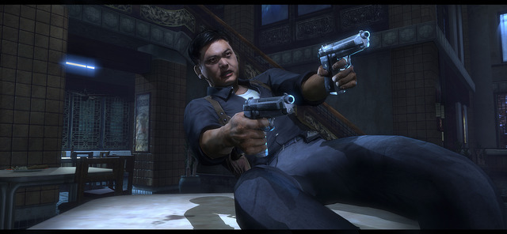

Contrairement à d'autres personnalité qui prêtent leur noms aux éditeurs de jeux vidéos juste pour arrondir leur fin de mois et que ceux-ci se vendent mieux, John Woo s'est apparemment très fortement impliqué dans la conception de ce jeu « *Next Gen* »[^1] qui nous permettra d'incarner le fameux Tequila.

[^1]: C'est à dire pour consoles de jeux actuelles, XBOX 360 ou PlayStation 3 en tête

Si vous ne faites pas directement le lien entre « John Woo » et « Tequila », c'est que vous n'êtes pas fan… 😉

Tequila est le héros de l'un des meilleurs films de John Woo — le dernier tourné chez lui à Hong Kong — intitulé « *Hard Boiled* » en anglais et « A toute épreuve » en français. Tequila est interprété par l'acteur fétiche de John Woo, j'ai nommé Chow Yun-Fat.

Dans [Stranglehold](http://www.jeuxvideo.com/jeux/0001/00014692.htm), l'action se déroule juste après la fin de « A toute épreuve », et semble tout aussi délirante en termes de « *gun fight* » avec des tonnes d'ennemis à dégommer avec différentes sortes d'armes, tout en faisant des cascades folles avec les objets environnants.

Les membres de Play3-Live, un site d'infos sur la PlayStation 3, ont eu la chance de [jouer à une pré version XBOX 360 de Stranglehold](http://www.play3-live.com/news-ps3-preview-de-stranglehold-4470.html) et on un avis plus que positif. Vivement le 7 septembre !

Un bonheur n'arrivant jamais seul, il se murmure qu'une édition spéciale du jeu contienne aussi le Blu-Ray du film, de quoi le redécouvrir avec une qualité optimale en Full HD.
