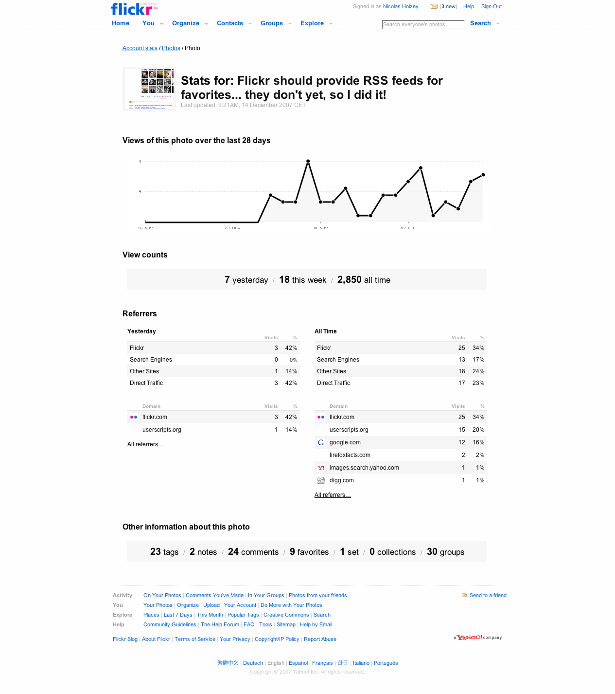
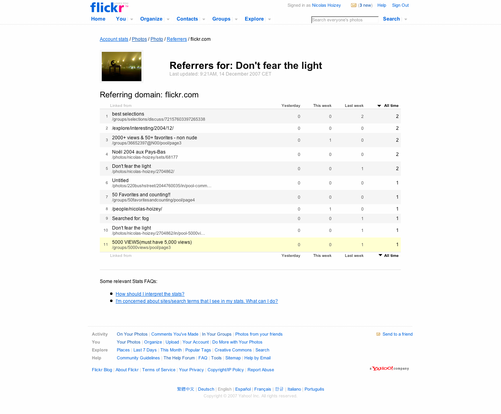

Même si diverses applications tierces fournissaient déjà quelques statistiques de consultation des pages et photos sur Flickr, il n'existait jusqu'à présent pas de tableau de bord global permettant de connaitre facilement l'état des lieux de son compte en termes de trafic. [C'est maintenant chose faite](http://blog.flickr.com/en/2007/12/13/stats-stats-baby/), Flickr propose un nouveau service de statistiques.

Une information intéressante et que seul Flickr pouvait fournir, concerne les sites référants[^1], ceux qui vous amènent des visiteurs.

Il est aussi possible de consulter les statistiques photo par photo, pour avoir des informations plus précises :

Et la visualisation des référants est justement possible photo par photo, ce qui est sans doute l'info la plus importante mise à disposition :

[^1]: *referers* en anglais
