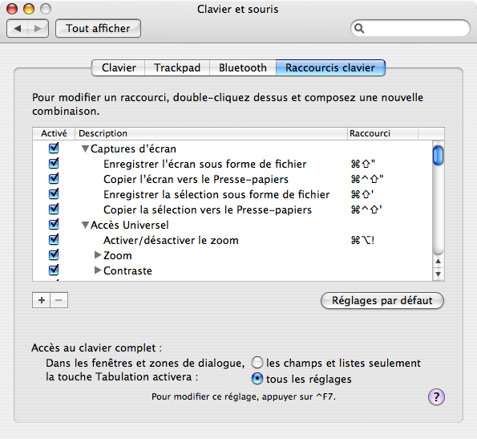

Par défaut, avec Mac OS X, la touche de tabulation ne permet de passer dans un formulaire qu'au champ de type texte ou liste suivant. Les autres types de champs sont tout simplement ignorés, ce qui impose d'utiliser la souris pour remplir un formulaire. Il va sans dire que la productivité est alors bien réduite. Heureusement, il existe un moyen très simple de changer ce comportement pour reproduire ce dont on a plus l'habitude sous Windows[^1].

[^1]: Oui, je suis un *switcher* heureux, mais je sais rester critique… 😉

Il suffit d'aller dans le panneau « Clavier et souris » des « Préférences Système », et d'y sélectionner tout en bas le bouton radio « tous les réglages » :

