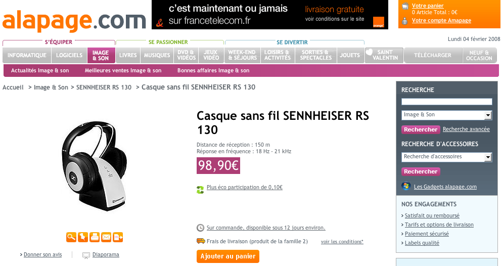

--- 
title:      "Web marchands : abuser de la longue traine peut nuire à votre image "
date: 2008-02-04 12:00:00 +02:00
lang:       fr 
tags:       [fail, marketing, ecommerce]
---

La [longue traine](http://fr.wikipedia.org/wiki/Longue_tra%C3%AEne), ce fameux principe statistique repris par [Chris Anderson](http://www.wired.com/wired/archive/12.10/tail.html)[^1] — rédacteur en chef de Wired — pour expliquer le succès de commerçants en ligne[^2] comme [Amazon](http://www.amazon.fr/), suppose la mise à disposition d'une multitude de produits de niche pour que la somme de leurs ventes dépasse celle des quelques produits phares habituellement proposés. Bien sûr, il faut les avoir, ces produits de niche…

[^1]: Voir aussi une [traduction française par InternetActu](http://www.internetactu.net/2005/04/12/la-longue-traine/).

[^2]: Web marchands ?

[Alapage](http://www.alapage.com/) — une filiale de France Télécom — est un site de vente en ligne relativement important, et qui existe depuis déjà longtemps. Il propose comme la plupart des autres vendeurs généralistes multimédia une panoplie assez large de produits, et c'est chez eux que j'avais trouvé avant noël un [casque sans fil Sennheiser RS 130](http://www.lesnumeriques.com/article-313-1667-165.html) que je souhaitais acheter, pour plus de 30% moins cher que chez les autres :

Je n'était pas pressé, et le prix était intéressant, donc le délai annoncé sur la page m'allait parfaitement :

Mais plus d'un mois après, je n'ai toujours pas reçu mon casque, et le suivi de commande indique juste que le produit est en attente.

Évidemment, « le délai moyen indiqué ne constitue pas un délai de rigueur et alapage.com ne pourra voir sa responsabilité engagée en cas de retard de livraison ou de rupture de stock chez l'éditeur ou le fournisseur », comme l'indiquent les [Conditions Générales de Vente](http://www.alapage.com/-/Editorial/?ref=5-356857#article3).

Alapage a tout de même fini par m'envoyer ce mail, 40 jours après la date de commande, donc après plus de trois fois le délai de livraison annoncé :

> 
> Bonjour,
> 
> Le délai de traitement de votre commande est maintenant largement dépassé et nous vous en présentons toutes nos excuses.
> 
> Malgré nos nombreuses tentatives, nous n'avons pas obtenu d'informations précises de nos interlocuteurs pour l'approvisionnement attendu.
> 
> Dans un soucis de transparence, et afin de vous permettre de prendre vos dispositions, nous préférons vous informer d'une possible rupture de stock.
> 
> Toute nouvelle information qui pourrait nous parvenir entre temps, vous sera bien sur adressée.
> 
> Dans la mesure ou au moins un article de votre commande est disponible, son expédition sera effectuée dans les heures à venir.
> 
> Recevez de nouveau nos excuses et nos remerciements pour votre compréhension, 
> L'équipe du service clients.
> 

Qu'un fournisseur ne fasse pas bien son boulot et que la livraison prenne du retard, je peux le concevoir. Mais que son client — pas tout petit qui plus est — ne puisse pas « obten[ir] d'informations précises de [ses] interlocuteurs pour l'approvisionnement attendu » ne donne pas confiance sur l'hypothèse d'une issue positive.

J'ai donc décidé d'annuler ma commande.

J'ai pour cela appelé le service client, et le message d'attente m'a indiqué que je pouvais annuler ma commande directement sur le site. J'y suis donc allé, mais je n'ai rien trouvé. Après plusieurs tentatives où la ligne était coupée sans avertissement, j'ai finalement réussi à avoir le service client, et à annuler ma commande.

Problème ponctuel ? Fournisseur mal choisi ? Quoi qu'il en soit, Alapage ne me reverra pas de sitôt, en tout cas pas pour acheter des produits indiqués « sur commande ».
