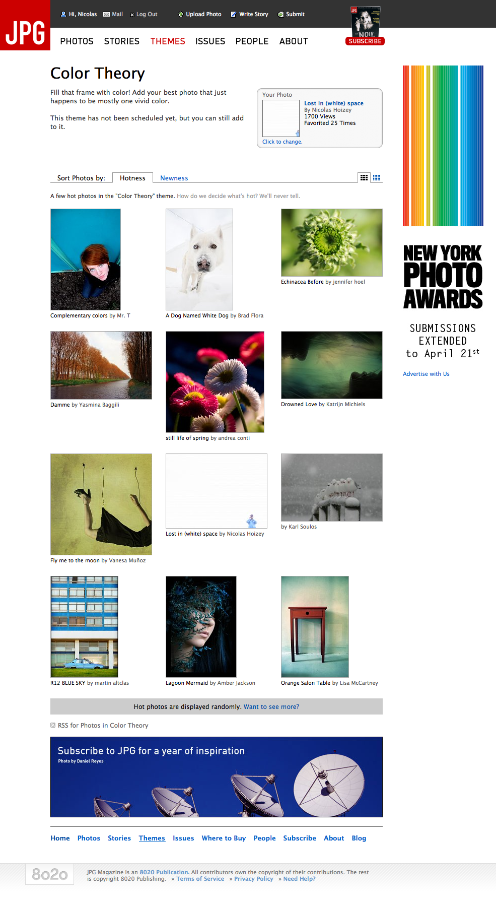

Comme je tente de le montrer sur cette récente nouvelle version de Gastero Prod avec une rubrique dédiée, je m'essaie depuis quelque temps à la photographie, et je dois avouer que tous les petits signes d'intérêt pour mes « œuvres » me font rudement plaisir. J'ai eu ainsi le bonheur de découvrir aujourd'hui que ma photo [Lost in (white) space](http://www.jpgmag.com/photos/20192) fait partie de la sélection « *hot* » du thème [Color Theory](http://www.jpgmag.com/themes/40) de [JPG Magazine](http://www.jpgmag.com/).

 space")

Vous voyez, au milieu de la page, ce petit badge :

C'est un badge présent sur les pages de photos qui sont mises en avant comme faisant partie des plus intéressantes d'un thème donné, et effectivement, la mienne apparaît parfois[^1] dans la page d'accueil du thème :

L'intérêt principal de JPG Magazine — par rapport à des sites purement communautaires comme [Flickr](https://www.flickr.com/) — c'est que chacun ne peut poster qu'une unique photo dans chacun des thèmes proposés, ce qui pousse à la qualité et évite les spams photographiques si présents dans les groupes de Flickr.

[^1]: C'est un choix aléatoire au sein de la sélection
