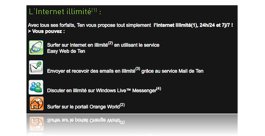

En réponse aux offres de surf illimité proposées par d'autres opérateurs, et sans doute aussi pour ne pas avoir l'air de favoriser l'iPhone par rapport à d'autres terminaux, [Orange](http://www.orange.com/fr_FR/) a lancé récemment l'offre [Ten](http://www.ten.fr/) qui promet l'illimité sur le surf, le mail et même la messagerie instantanée… attention danger !

L'offre « Ten by Orange » est en effet assez dangereuse pour sa facture si on ne fait pas attention.

J'ai par exemple pu testé avec un [HTC Touch](http://www.ten.fr/telephone_details.php?id=12030918074022) :

Et voici la promesse faite par cette offre Ten by Orange :

Après différentes tentatives de surf et consultation de mails, j'ai découvert qu'il y a les restrictions suivantes, vraiment pas clairement exprimées par Orange, et inconnues des vendeurs des boutiques Orange ou Photo Service[^1] :

- Le mail n'est gratuit qu'avec le système fourni par Ten supposant un forward de ses mails vers l'adresse e-mail fournie avec l'abonnement Orange, pas si on utilise Pocket Outlook en IMAP, avec GMail par exemple
- Le surf n'est gratuit qu'avec le navigateur [Opera Mini](http://www.operamini.com/) fourni par Ten, pas avec Pocket IE, alors que c'est ce dernier qui s'ouvre par défaut quand on clique sur une URL

En gros, on a un smart phone avec Windows Mobile 6 et tous ses logiciels, mais on ne peut pas les utiliser, il faut se restreindre à la suite logicielle fournie par Ten.

Heureusement, même si je trouve honteux d'omettre de donner cette information au client, Orange est couvert puisqu'[on la trouve](http://www.ten.fr/services_ten.php) en cherchant un peu sur leur site :

En cherchant un peu plus, notamment dans des [forums](http://www.forummobiles.com/index.php?showtopic=163316), j'ai finalement trouvé [le wiki officiel de Ten](http://wiki.ten.fr/wiki/index.php?title=Internet), vers lequel je n'ai pas trouvé de lien sur le site de l'offre, mais qui précise bien la limitation au sujet du mail :

> « L’application Mail déjà présente dans votre téléphone s’appelle un "client Mail" embarqué. Vous pouvez l’utiliser, mais **cela ne fait pas partie de votre forfait Ten internet illimité**. Cela veut dire que vous serez facturés, au prix du trafic GPRS en vigueur, à chaque fois que vous recevrez ou enverrez des emails. »

Au final, une offre tout de même intéressante, mais dont l'usage est inutilement complexifié — sous prétexte de simplification ! — ce qui risque de conduire à des débordements de facture désagréables…

[^1]: Qui est maintenant associé à Orange, pas étonnant vu l'essor des « photo phones »
