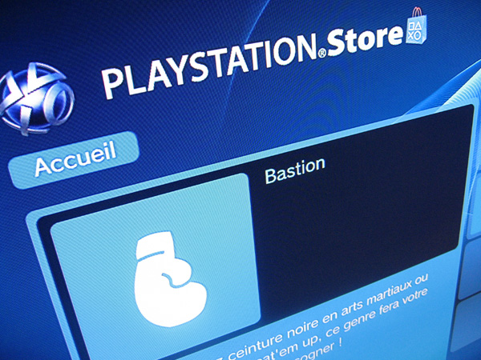

Oui, oui, vous avez bien lu, c'est bien de jeux de « bastion » que je parle, le genre qui laisse imaginer des combats entre deux équipes pour conquérir le territoire de l'autre. En tout cas c'est ce que proposait le [PlayStation Store](http://store.playstation.com/) lors de sa récente mise à jour…

Bon, depuis ils ont modifié, ils parlent de jeux de « baston », c'est du coup beaucoup plus classique, ça m'intéresse moins, tant pis pour l'originalité[^1].

[^1]: Faut plutôt aller voir [ici](http://www.nonwii.com/) pour l'originalité, de toute façon…
