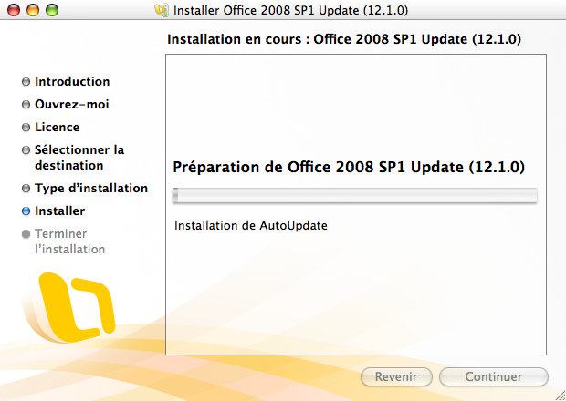

Il est parfois amusant de découvrir des bugs de logiciels, surtout s'ils n'empêchent pas de travailler et viennent de gros éditeurs dont on attendrait une qualité parfaite. C'est encore plus amusant quand le bug intervient dès le lancement du logiciel, en l'occurrence ici la mise à jour automatique de Microsoft Office:mac 2008 juste après son installation.

J'ai en effet eu l'amusante surprise de découvrir que la première chose que tente d'installer le *Service Pack 1* de Microsoft Office:mac 2008, c'est *AutoUpdate*, dont je ne vous ferais pas l'affront de décrire la fonctionnalité :

Sauf que comme souvent, il faut fermer certaines applications pour assurer une installation sans soucis, et ici pour installer l'AutoUpdate en question, il faut arrêter… AutoUpdate !

Alors, l'œuf ou la poule ?
