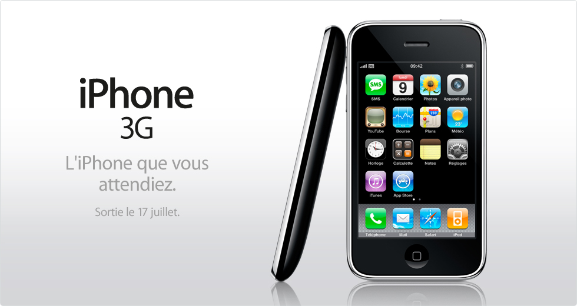

Cela ne vous a sans doute pas échappé, Apple sort enfin un iPhone digne de ce nom, au point de compléter son nom avec ce qui manquait le plus à sa version *beta*[^1], la 3G. Voici donc l'iPhone 3G qui débarque dans le monde entier le 11 juillet… ah, non, attendez, [nous ne l'aurons que le 17 juillet en France](http://www.iphon.fr/post/2008/06/09/Le-11-Non-le-17-juillet), le 11 était déjà réservé par plus important.

[^1]: Ils n'ont pas encore compris que c'est tendance d'être en *beta*, sinon ils l'auraient clairement indiqué et ils en auraient peut-être vendu plus… 😉

Eh oui, c'est le 11 juillet que sort « Comme si de rien n'était »,[^2] le 3ème album de Carla Bruni[^3], Première dame de France.

On imagine bien l'ombre qu'aurait pu faire l'iPhone à ce futur hit, vous n'imaginiez quand même pas crédible que [Orange](http://iphone.orange.fr/) ai besoin de 6 jours de plus que tant d'autres pour préparer le lancement…

[^2]: La virgule est importante, c'est beau la langue française… 😉

[^3]: Oui, « Bruni », pas « Bruni Sarkozy », faut pas [mélanger les multiples facettes de madame](http://www.europe1.fr/Info/Actualite-Politique/Institutions/Carla-Bruni-reste-de-gauche-mais-votera-Sarkozy)…
