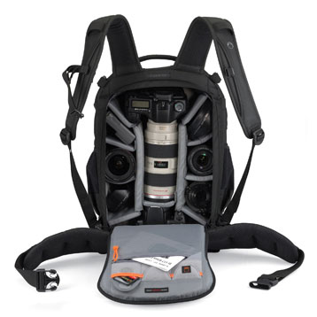

Je trimballe pour l'instant mon Canon EOS 350D[^i1] et ses accessoires dans un sac à dos photo [Lowepro Mini Trekker Classic](http://www.google.fr/images?hl=fr&q=lowepro+Mini+Trekker+Classic). Je l'avais obtenu quasiment gratuitement avec un abonnement à [Réponses Photo (fr)](http://fr.wikipedia.org/wiki/R%C3%A9ponses_Photo), donc je n'ai pas trop réfléchi à l'époque à ses avantages/inconvénients par rapport à la concurrence. Mais maintenant que je vais monter en gamme au niveau matériel, et du coup aussi en poids total, je cherche un sac en conséquence, notamment pour ce qui est de l'espace de rangement, de l'ergonomie, et du confort de portage.

[^i1]: Les ricains l'appellent *Digital Rebel*, bien plus poétique…

Voilà ce que je trimbale donc pour l'instant dans mon Lowepro Mini Trekker Classic :

- Le boitier Canon EOS 350D,
- Le zoom trans-standard [Canon EF-S 17-85mm f/4.0-5.6 IS USM (fr)](http://www.amazon.fr/dp/B0002XNRG4/gasteroprod-21) vissé dessus,
- Un télé zoom [Canon EF 70-300mm f/4.0-5.6 IS USM (fr)](http://www.amazon.fr/dp/B000B84KB6/gasteroprod-21),
- Un objectif macro [Canon EF 100mm f/2.8 USM (fr)](http://www.amazon.fr/dp/B00005KHRX/gasteroprod-21),
- Une [bonnette Macro Canon 250D (fr)](http://www.amazon.fr/dp/B00008AZZI/gasteroprod-21) pour aller encore plus près et surtout plus gros,
- Un flash [Canon Speedlite 430 EX II (fr)](http://www.amazon.fr/dp/B001AXFV5A/gasteroprod-21),
- Un [GPS Garmin Colorado 300 (fr)](http://www.amazon.fr/dp/B0012XKCXO/gasteroprod-21) pour la balade et la géolocalisation de mes photos,
- Divers accessoires de taille plus ou moins réduite mais faisant quand même au total un volume respectable : [batteries (fr)](http://www.amazon.fr/dp/B000ZNY2O2/gasteroprod-21), piles, chargeurs, cartes mémoire, [télécommande sans fil (fr)](http://www.amazon.fr/dp/B00005LLPA/gasteroprod-21), bouchons d'objectifs de rechange, stylos, etc.

Tout cela rempli bien le sac, dont le confort sommaire trouve ses limites avec le poids considéré lors de balades prolongées.

Depuis très peu de temps[^1], il y a en plus un boitier [Canon EOS 5D Mark II (fr)](http://www.amazon.fr/dp/B001G7PBIC/gasteroprod-21) accompagné d'un zoom trans-standard [Canon EF 24-70mm f/2.8 L USM (fr)](http://www.amazon.fr/dp/B00007EE8M). Le 350D et son trans-standard EF-S resteront peut-être dans le sac pour usage complémentaire, le 350D étant notamment intéressant en télé avec le 300mm transformé « magiquement » en 480mm[^2].

Voici en gros ce que le Mini Trekker Classic n'offre pas et me serait bien utile :

- un meilleur confort de portage avec bretelles plus large et dos plus ergonomique
- suffisamment de place pour le 5D Mark II avec une poignée
- une meilleure protection aux chocs
- une meilleure sécurité lors de balades/voyages en zones sensibles
- une protection pluie
- un système d'attache du pied

Après recherche[^3] dans les gammes de différentes marques, notamment [Lowepro (en)](http://www.lowepro.com/) parce que je connais déjà et que la gamme est très large, [Crumpler (fr)](http://www.crumpler.fr/?categroy=Photo_Bags&page=products&category=3) parce que leurs sacs sont plus jolis et moins typés photographe[^4], ou des moins courants comme Kata, Tamrac ou Vanguard, le [Lowepro Flipside 400 AW (en)](http://products.lowepro.com/product/Flipside-400%20AW,2116.htm)[^5] est pour l'instant ce qui me semble le plus adapté. Il répond bien aux critères indiqués ci-dessus, et est même disponible en coloris vert un peu plus joli que le noir si classique. Certes il est moins joli que les Crumpler, mais pour avoir manipulé les deux, il est vraiment plus pratique.

Voilà ce que ça donne :

Et vous, qu'utilisez-vous pour trimbaler votre matériel photo ? Connaissez-vous ce Lowepro Flipside 400 AW et le recommanderiez-vous ?

[^1]: Canon a du mal à livrer ses distributeurs, mais le Père Noël l'a peut-être aidé à améliorer sa logistique…

[^2]: Je dois toujours faire une comparaison précise, les possibilités de *crop* du gros capteur du 5D Mark II permettant sans doute d'obtenir en fait le même résultat sans besoin de trainer deux boitiers.

[^3]: Notamment dans différents forums dont celui d'[EOS Numérique (fr)](http://www.eos-numerique.com/forums/f35/sacs-photo-les-marques-et-modeles-vos-avis-et-commentaires-50504/) ou sur des sites ultra spécialisés comme [CamBags (en)](http://www.cambags.com/camera_bag_mainpage.htm) ou [taschenfreak.de (de)](http://taschenfreak.de/indexliste.htm)…

[^4]: Et donc moins attirants pour les éventuels brigands

[^5]: Dont un test assez complet a été fait par [0xCAFE (fr)](http://bloguedegeek.net/2008/10/28/lowepro-flipside-400-aw-sac-a-dos-pour-photographe-evaluation/).
