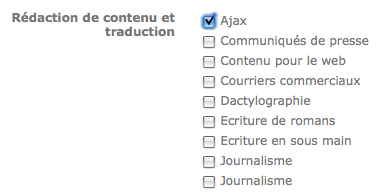
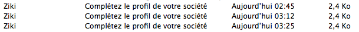

J'avoue que cela faisait un certain temps que je n'avais pas visité Ziki, et j'ai découvert qu'ils sont passé d'un site de gestion de l'identité numérique[^1] — voici [mon profil Ziki](http://www.ziki.com/fr/nhoizey+1005) — à « une place de marché professionnelle qui met en relation des fournisseurs avec leurs acheteurs potentiels ». En plus du changement de *business model*[^2], Ziki s'est doté de quelques bugs.

[^1]: On parle même d'Identité 2.0 !

[^2]: C'est clair qu'une entreprise sera plus prête à dépenser des sous qu'un individu

Par exemple, quand je veux modifier mes compétences, je me retrouve avec un onglet « Undefined » :

Et si je veux mettre à jour le [profil Ziki de Clever Age](http://www.ziki.com/fr/clever-age+1955), et indiquer les secteurs d'activité, je me retrouve avec des doublons dans les propositions, sur le « graphisme » :

Et quand je veux modifier les compétences, j'ai des doublons sur le « journalisme » :

Pire, si je ne remplie pas complètement le profil de ma société, on me relance, ce qui est compréhensible, mais une seule fois, non, trois ! Et en moins d'une heure :

Cela fait quand même beaucoup de bugs qui n'auraient pas dû passer au travers des mailles de l'équipe de recette…
