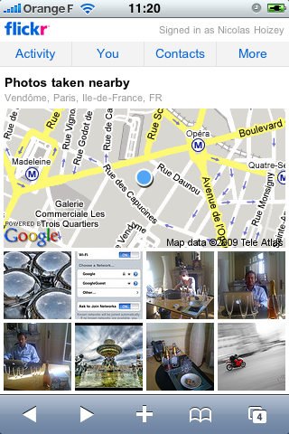

Dans une nouvelle version de [Flickr pour mobiles](http://m.flickr.com/)[^1], [Flickr](https://www.flickr.com/) propose une fonctionnalité permettant de voir les photos géolocalisées prises près de là où vous êtes. Surprise, ce sont des cartes [Google Maps](http://maps.google.com/) qui sont utilisées, alors que le site Flickr utilise plutôt d'habitude des [cartes Yahoo! Maps](https://www.flickr.com/map/)[^2].

[^1]: En tout cas tel que visible sur iPhone

[^2]: Logique, [Flickr est la propriété de Yahoo!](/2005/03/flickr-dans-l-escarcelle-de-yahoo.html) depuis quelque temps…

Alors, glissement progressif ?
