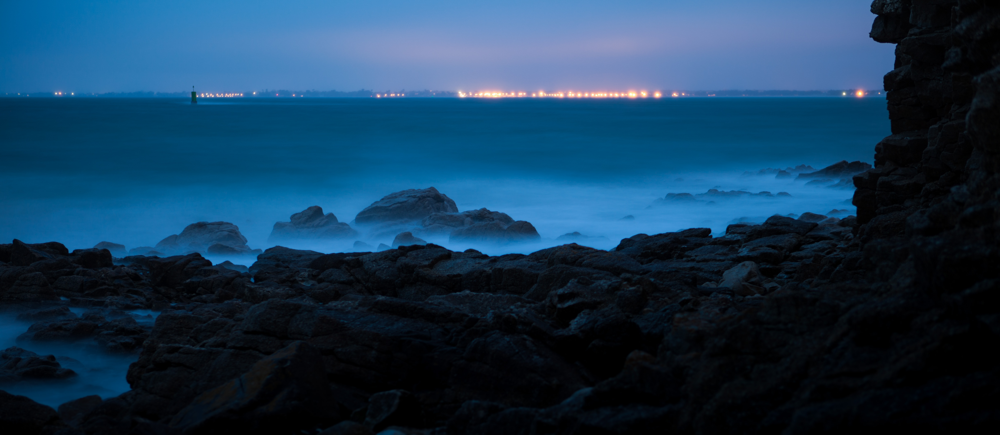

[Thanh](http://www.sutekidane.net/) vient de me raccrocher à [une chaine](http://www.sutekidane.net/blog/la-vie-en-bleu.html) qui a pour principe de publier 7 clichés sur le thème du « bleu ». Ça tombe bien, c'est une couleur que j'aime particulièrement, je relève le défit volontiers !

# Lost in (white) space

Pour commencer en douceur, une photo où le bleu n'est pas dominant, mais sans lequel il n'y aurait aucun intérêt :

 space ([on Flickr](https://www.flickr.com/photos/nicolas-hoizey/10566776/))")

# Une fenêtre de Burano

Si vous avez la chance d'avoir fait un séjour à Venise, vous êtes sûrement allé voir l'île voisine de Burano, réputée pour ses maisons aux couleurs vives. Voici un exemple de juxtaposition de couleur entre [une fenêtre de Burano](/2008/06/une-autre-fenetre-de-burano.html) et le mur sur lequel elle se trouve :

)")

# En mer

Bien sûr, quand on cherche du bleu, on pense vite au ciel et à la mer. Et contrairement à ce qu'on pourrait penser[^1], voici la Mer Rouge, qui est bel et bien bleu :

)")

# Plongée en contre plongée

Mais pour bien apprécier ce bleu marin, le mieux c'est de s'y plonger :

)")

# Split level photography

Et c'est en revenant à la surface que l'on constate que même le ciel bleu d'Egypte est bien fade par rapport à celui des profondeurs[^2] :

)")

Au passage, c'est ce genre de cliché que j'affectionne particulièrement qui m'a poussé à créer le groupe Flickr « [Split level photography: camera halfway between air and water ](https://www.flickr.com/groups/halfway_air_water/) » auquel je vous invite à contribuer.

# Along the shore

Et le soir venu, rien de tel qu'une [pose longue sur la côte](/2009/06/along-the-shore.html) pour apprécier le flux et reflux de la mer :

# Fluorescent Jellyfishes

Et pour finir en apothéose, toujours sur un thème marin, voici une photo de [méduses fluorescentes](/2008/07/meduses-fluorescentes.html) prise dans le Zoo de Rhenen, aux Pays Bas :

)")

C'est de loin ma préférée, et elle semble être aussi pas mal appréciée sur Flickr.

# Le chainon manquant

Pour continuer la chaîne, j'invite — par ordre alphabétique — [Nicolas](http://www.prendreuncafe.com/), [Nicolas](http://nicolas.steinmetz.fr/), [Nicolas](http://www.nicolasdory.com/), <del>Nico</del>… [Raphaël](http://www.strasbourg-photo.com/), [Stéphane](http://nota-bene.org/), [Thomas](http://case.oncle-tom.net/) et [Xavier](http://lacot.org/) à participer[^3], à vous de jouer !

[^1]: Non, sérieusement, vous ne le pensiez pas ?

[^2]: Bon, OK, là c'est le capteur de mon compact qui a du mal à exposer comme il faut…

[^3]: C'est bien 7, qu'il en fallait ?
