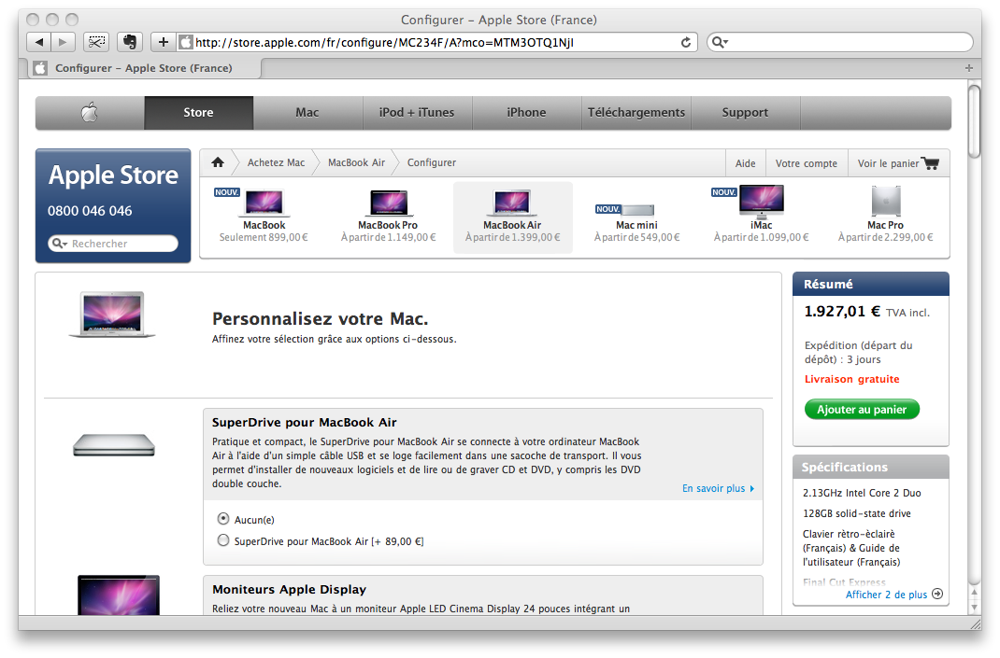

Depuis quelques jours, le menu de navigation principal de Gastero Prod reste visible en permanence[^1] même si vous descendez dans la page. Cela peut vous sembler un caprice de g33k qui tente des trucs un peu sexy, mais à l'usage, je suis extrêmement content de ce rapide ajout ergonomique !

[^1]: Sur les navigateurs graphiques où les CSS et le JavaScript sont activés…

Un menu de navigation toujours visible, même en défilant sur plusieurs hauteurs d'écran, cela signifie que l'on a moins besoin des liens de type « retour en haut de page » que je ne sais jamais où placer, et que certains du coup se mettent à placer presque à chaque paragraphe pour être sûr[^2]. Cela signifie aussi que l'internaute pourra accéder plus vite à d'autres rubriques du site, en un seul clic.

J'ai vu ce type de fonctionnement pour la première sur le panier dans l'Apple Store :

Sur l'Apple Store, c'est d'ailleurs encore plus subtil, le bloc présentant les spécifications du produit commandé se réduit automatiquement si la place disponible en hauteur n'est pas assez grande, beau soucis du détail !

Je l'ai vu plus récemment sur le bloc « View options » à droite des résultats de recherche sur MyFonts :

Je n'avais pas encore pensé à appliquer ce principe bien sympathique à mon site, mais l'article [Fixed Floating Elements](http://jqueryfordesigners.com/fixed-floating-elements/) de [jQuery for Designers](http://jqueryfordesigners.com/) présentant l'approche technique m'a mis le pied à l'étrier, je n'ai pas su résister !

[^2]: J'exagère à peine
