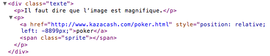

Un p'tit malin qui se fait appeler Sylvain a laissé un commentaire très sympathique sur [mon billet précédent](/2010/02/tumblr-aime-mes-meduses.html). Mais il a aussi glissé subrepticement un lien vers un site de *poker fashion*…

Voilà à quoi ressemblait le commentaire avant que je le retire :

C'est la flèche orange sous le texte —indiquant normalement un lien vers un autre site— qui m'a mis la puce à l'oreille, et après vérification, il y a bien un tel lien, vers un site marchand.

Ce petit malin de Sylvain a cru me duper, et ainsi gagner facilement du référencement avec un nouveau lien entrant, en masquant son lien avec un peu de CSS[^1] :

Dommage pour lui, pris sur le fait !

[^1]: Le `` est de moi, c'est lui qui permet l'affichage de la flèche.
