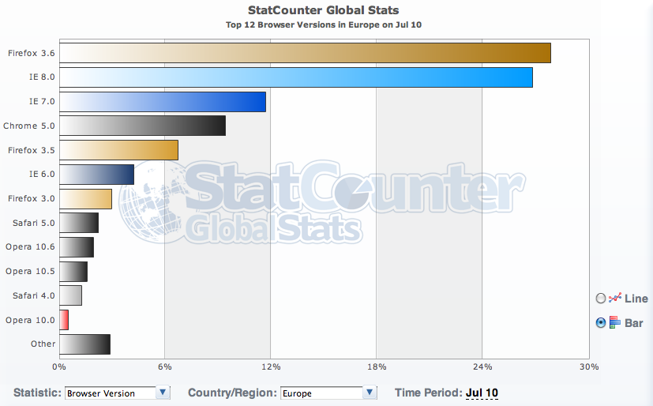

*Article initialement publié dans [le blog de Clever Age](http://www.clever-age.com/veille/blog/faut-il-continuer-a-supporter-internet-explorer-6-.html).*

On ne va pas ergoter sans fin, tout le monde doit maintenant savoir que [Internet Explorer](http://fr.wikipedia.org/wiki/Internet_Explorer) 6 — IE6 pour les intimes — est un navigateur obsolète et dangereux. Et pourtant, certains continuent à l'utiliser. Faut-il les en dissuader, refuser de leur fournir son support, aller même jusqu'à leur empêcher l'accès, ou faut-il continuer à supporter (les faiblesses de) ce navigateur ?

# Petit aperçu du marché

On le sait, les parts de marché de IE6 — et même de IE toutes versions confondues — diminuent largement, notamment grâce à Mozilla Firefox depuis quelques années, et Google Chrome plus récemment.

Mais on sait souvent moins que cette situation globale n'est pas forcément représentative de chaque contexte local.

Globalement, l'Europe est largement soulagée par des parts de marché de IE6 tombées en dessous de 5%[^europe] :

[^europe]: Statistiques fournies par [StatCounter](http://gs.statcounter.com/#browser_version-eu-monthly-201007-201007-bar)

Mais ce n'est qu'une moyenne globale, qui masque notamment une forte différence entre marché des professionnels et marché des particuliers, les seconds ayant tendance à être bien plus à jour.

L'autre aspect qui peut nous échapper si l'on ne regarde que les chiffres mondiaux ou européens[^1], c'est que d'autres régions du globe sont bien moins avancées que nous dans cet abandon d'IE6, notamment l'Asie[^asie] et l'Afrique[^afrique] :

[^asie]: Statistiques fournies par [StatCounter](http://gs.statcounter.com/#browser_version-as-monthly-201007-201007-bar)

[^afrique]: Les autres continents sont plus avancés, et préfèrent en général IE8 à Firefox.

Il faudra encore sans doute beaucoup de temps avant que IE6 soit complètement éradiqué du Web[^3].

# IE6 est vieux et largement dépassé

[IE6](http://en.wikipedia.org/wiki/Internet_Explorer_6) est sorti en août 2001, soit la préhistoire en chronologie Web, et a déjà vu deux versions majeures lui succéder, [IE7](http://fr.wikipedia.org/wiki/Internet_Explorer_7) en octobre 2006 et [IE8](http://fr.wikipedia.org/wiki/Internet_Explorer_8) en mars 2009.

Dans le même temps, les standards de développement Web ont largement évolué, apportant de nombreuses fonctionnalités et facilités pour réaliser des sites toujours plus riches, et néanmoins de plus en plus accessibles, et simples à maintenir et faire évoluer.

Il n'est ainsi pas possible de profiter nativement et sans sueurs froides dans IE6 des CSS 2.1, de la transparence des PNG, et de tant d'autres [standards actuels de développement Web bien supportés par les navigateurs modernes](http://caniuse.com/), qui ne sont d'ailleurs pas non plus supportés par IE7 et IE8[^4].

# IE6 n'est pas assez sécurisé pour le Web actuel

Il n'y a pas beaucoup de vraies [failles de sécurité dans IE6](http://secunia.com/advisories/product/11/?task=statistics), Microsoft continuant tant bien que mal à proposer des patchs lorsque des failles critiques sont identifiées, mais IE6 ne propose aucun moyen de protection contre les attaques plus subtiles apparues ces dernières années, dont le *phishing*.

Microsoft essaie d'ailleurs de [sensibiliser ses utilisateurs sur ce sujet](http://arstechnica.com/microsoft/news/2009/12/microsoft-highlights-security-to-push-ie6-users-to-ie8.ars) pour les faire migrer vers IE8.

# Mais pourquoi donc certains s'évertuent-ils à conserver IE6 ?

Forts de ces constats, on peut légitimement se demander pourquoi tout le monde n'a pas naturellement jeté depuis longtemps IE6, au profit d'une version plus récente ou d'un navigateur résolument plus moderne[^5], tel que Mozilla Firefox, Google Chrome, Apple Safari ou Opera.

En 2002/2003, Internet Explorer dominait très largement le marché des navigateurs Web[^6] grâce essentiellement à la disparition de son illustre — et quasi unique — concurrent Netscape.

Livré avec Windows XP, IE6 s'est assez naturellement installé dans les esprits comme l'unique navigateur à supporter en entreprise, où les parcs informatiques sont en général relativement homogènes, et où les quelques navigateurs alternatifs n'avaient pas droit de citée.

L'explosion des technologies Web au début des années 2000 a conduit pas mal d'éditeurs de progiciels à migrer du client/serveur vers le Web, cela permettant essentiellement de simplifier les problématiques de déploiement[^7]. Venant d'une techno où toute la chaine du client au serveur était maîtrisée avec une unique techno, ces éditeurs ont considéré que supporter l'unique — ou presque — navigateur présent à l'époque sur le marché, surtout en entreprise, était bien suffisant, sans se demander si ce navigateur était conforme aux standards utilisés.

Les clients de ces éditeurs ont eux aussi fait complètement confiance à Microsoft et son IE6, comme étant une solution magique à certains de leurs problèmes, et les parts de marché étant telles qu'il était très difficile pour des non experts d'imaginer ce qui s'est produit ensuite.

Aujourd'hui, beaucoup de ces clients utilisent toujours des progiciels qui leur ont coûté très cher en achat de licences, maintenance et/ou développements spécifiques, et ne peuvent pas envisager de migrer vers des versions plus récentes, souvent parce que cela nécessiterait autant, voire plus, d'investissements, les technologies ayant bien changé. Malheureusement, ils ne peuvent pas non plus migrer de IE6 vers d'autres navigateurs, les développements initiaux ayant été faits en considérant les bugs de IE6 comme étant le standard, et ne fonctionnant du coup plus dans les navigateurs implémentant les standards, même partiellement comme IE7 et IE8.

Compte-tenu des soucis de sécurité posés par IE6, et de l'impossibilité de faire tourner simultanément plusieurs versions d'IE sur un même Windows, certains commencent tout de même à mettre à disposition de leurs utilisateurs un second navigateur pour l'accès au Web, IE6 étant restreint à l'usage spécifique de certains progiciels internes. Mais l'utilisateur doit alors savoir quel navigateur utiliser à quel moment, et les responsables des postes utilisateurs doivent gérer une configuration plus complexe qu'elle ne devrait l'être.

Une alternative intéressante — et semble-t-il peu connue — est de migrer de Windows XP vers Windows Seven et de profiter du « [XP Mode](http://windows.microsoft.com/fr-FR/windows7/products/features/windows-xp-mode) » permettant de faire fonctionner sans licence supplémentaire[^8] un Windows XP dans une machine virtuelle [Virtual PC](http://www.microsoft.com/france/windows/virtual-pc/default.aspx)[^9]. Mais les postes utilisateurs ne sont pas toujours suffisamment puissants, et une migration Seven risque de poser d'autres problèmes…

Certains restent donc cantonnés à IE6 uniquement.

Certains continuent donc à assurer le support de IE6 dans leurs créations, de peur de perdre des utilisateurs/clients.

Les intégrateurs continuent donc à développer en supportant IE6, afin de satisfaire leurs clients et ne pas les perdre.

# IE6 must die!

Malheureusement, c'est un cercle vicieux, certains ont toujours des IE6, donc nous faisons des développements qui leurs sont destinés, donc ils ne s'aperçoivent pas que leur navigateur aurait tout intérêt à être jeté.

Les intégrateurs Web en ont clairement assez de s'embêter régulièrement avec les contorsions nécessaires pour faire en sorte qu'un site bien conçu avec les standards soit tout de même utilisable avec IE6.

[IE6 doit donc mourir](http://mashable.com/2009/07/16/ie6-must-die/) pour que nous puissions aller de l'avant en utilisant les standards modernes du Web.

Même Microsoft est très embêté par cette persistance de IE6 sur le marché, qui lui impose de continuer à développer des patchs au moins pour les failles de sécurité, au point d'avoir [salué avec humour](http://blog.seattlepi.com/microsoft/archives/196608.asp) ses [obsèques](http://ie6funeral.com/) organisées récemment.

# Le support de IE6 est abandonné par des figures de proue du Web

Heureusement, certains ont le courage de prendre la décision de mettre fin au support de IE6, qu'il s'agisse de relativement petits comme [Digg](http://about.digg.com/blog/much-ado-about-ie6) ou [37signals](http://37signals.blogs.com/products/2008/07/basecamp-phasin.html), mais aussi d'immenses comme Facebook[^10] ou [Amazon](http://forabeautifulweb.com/blog/about/internet_explorer_6_no_longer_supported_by_amazon/), et bien sûr l'un des plus emblématiques, [Google ayant fait cette annonce en début d'année pour Google Apps](http://googleenterprise.blogspot.com/2010/01/modern-browsers-for-modern-applications.html), mais ayant déjà pris cette direction auparavant notamment pour [YouTube](http://www.google.com/support/youtube/bin/answer.py?hl=en&answer=175292).

Mais cela n'a sans doute qu'un impact restreint sur les entreprises, dans la mesure où cela touche plus souvent les usages personnels.

# IE6 peut-il rester utilisable sans qu'aucun travail spécifique soit fait pour lui ?

Si l'on accepte — à contre cœur — que certains ne puissent pas faire autrement que de rendre leurs sites et applications utilisables dans IE6, et de travailler pour eux, il est nécessaire de bien comprendre quelles sont les implications.

Il faut notamment cesser de masquer cette contrainte dans la masse de travaux d'intégration d'un projet, mais plutôt bien mettre en évidence les charges liées uniquement à ce travail d'adaptation particulier, ce qui permettra aux donneurs d'ordre de bien comprendre les enjeux économiques, qui sont ceux qu'ils comprennent le mieux.

[^1]: L'Europe et l'Amérique du Nord pesant beaucoup dans la moyenne mondiale.

[^3]: On croise bien encore parfois des Netscape 4 ou Internet Explorer 5.2 pour Mac…

[^4]: Le futur [IE9 fera un bon en avant en terme de support des standards](http://forabeautifulweb.com/blog/about/internet_explorer_9_in_on_the_boil/), mais il n'est pas encore là…

[^5]: En attendant un IE9 qui s'annonce bien meilleur ?

[^6]: Etant aux alentours de 95% en cumulant IE6 et les résidus de IE5

[^7]: Il y aurait beaucoup à dire sur les bonnes et mauvaises raisons de cette migration, ce n'est pas le propos de ce billet.

[^8]: A condition d'être en version pro

[^9]: Voir les explications détaillées dans [ce test de Présence PC](http://www.presence-pc.com/tests/mode-Windows-XP-Windows-7-23175/).

[^10]: Sauf que là, ça pourrait inciter les entreprises à conserver IE6 justement pour que les employés n'y passent pas leur temps de travail…
