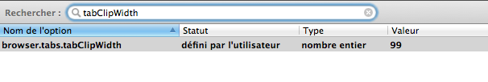

Quand on commence à avoir beaucoup d'onglets ouverts dans Firefox, la RAM souffre… non, ce n'est pas de cela que je voulais parler, je recommence… Quand on commence à avoir beaucoup d'onglets ouverts dans Firefox, l'espace restant sur chaque onglet se réduit, et l'affichage du titre est privilégié, ce qui peut conduire à la suppression du bouton de fermeture d'onglet, qui n'est plus alors disponible que sur l'onglet courant.

Il existe différentes solutions d'élégance variable, à base d'[extension Tab Mix Plus](https://addons.mozilla.org/fr/firefox/addon/tab-mix-plus/) par exemple, mais le plus simple est tout simplement de changer une configuration de Firefox via `about:config`.

Il faut modifier la valeur du paramètre `browser.tabs.tabClipWidth`[^1], qui défini la taille minimum à partir de laquelle le bouton apparaît.

Sachant que la taille minimum d'un onglet est de 100 pixels par défaut — c'est modifiable dans `UserChrome.css` ou avec l'extension [Custom Tab Width](https://addons.mozilla.org/en-US/firefox/addon/custom-tab-width/) —, il suffit de mettre une valeur de 99 à `browser.tabs.tabClipWidth` pour toujours avoir le bouton de fermeture.

[^1]: Voir la description de [`browser.tabs.tabClipWidth` dans la *knowledge base* de mozillaZine](http://kb.mozillazine.org/Browser.tabs.tabClipWidth).
