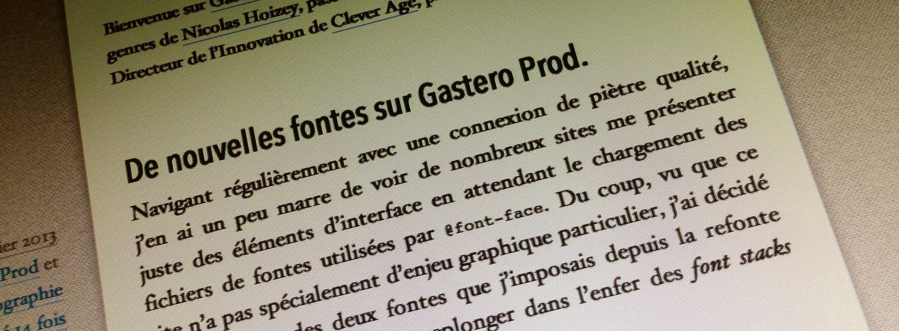
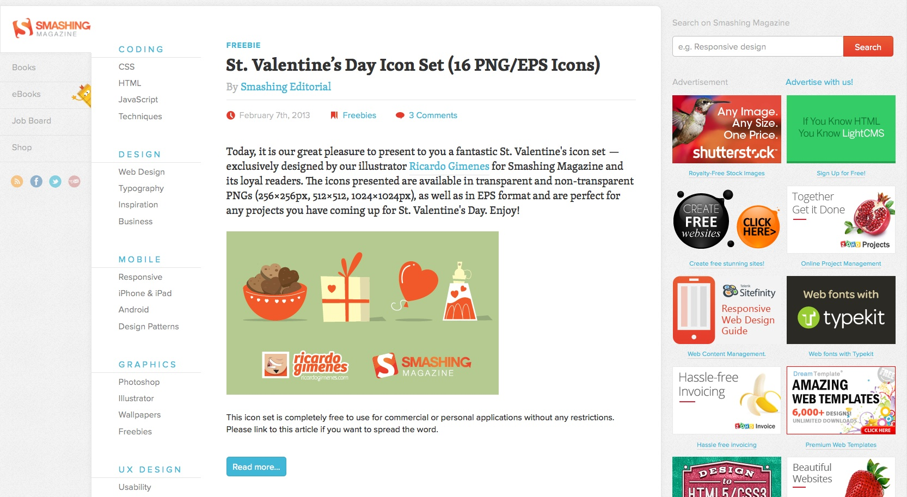
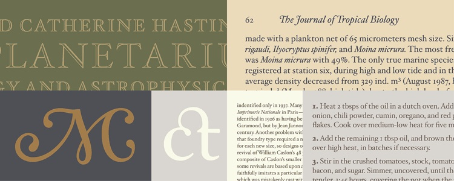
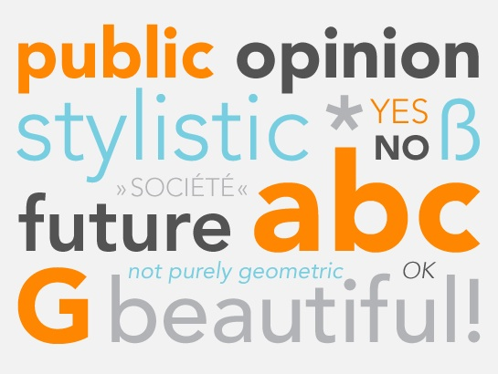
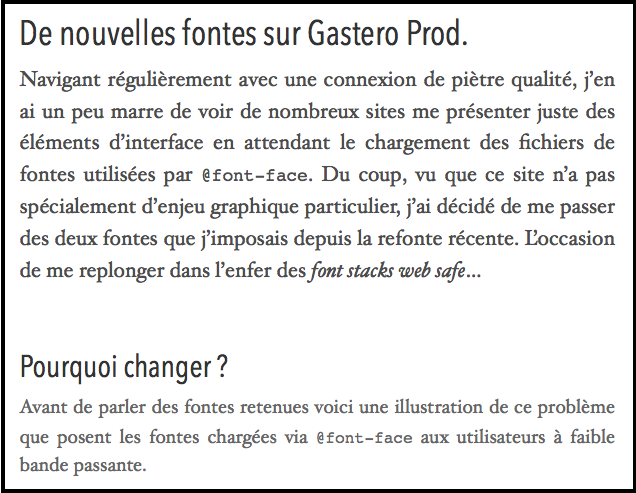

Navigant régulièrement avec une connexion de piètre qualité, j'en ai un peu marre de voir de nombreux sites me présenter juste des éléments d'interface en attendant le chargement des fichiers de fontes utilisées par `@font-face`. Du coup, vu que ce site n'a pas spécialement d'enjeu graphique particulier, j'ai décidé de me passer des deux fontes que j'imposais depuis la refonte récente. L'occasion de me replonger dans l'enfer des *font stacks web safe*…



# Pourquoi changer ?

Avant de parler des fontes retenues voici une illustration de ce problème que posent les fontes chargées via `@font-face` aux utilisateurs à faible bande passante.

[Le site de Smashing Magazine](http://www.smashingmagazine.com/) utilise deux fontes différentes pour la titraille et le corps de texte, chacune étant définie avec une instruction `@font-face` et nécessitant donc le téléchargement des ressources correspondantes. Ces fontes font partie des éléments importants du récent redesign du site, et participent à sa qualité visuelle, ce serait dommage de s'en priver :



Mais si on va sur le site avec une connexion pas géniale, on obtient très rapidement certains éléments graphiques, et beaucoup moins vite les fichiers des fontes, d'où un affichage assez étonnant :


On constate assez simplement d'où vient le problème :


Nous sommes donc en attente des fichiers des deux fontes, et pendant ce temps là le navigateur ne peut pas afficher le texte.

Quand `@font-face` a commencé à être largement implémenté dans les navigateurs, ils ne se comportaient pas de la même façon. Firefox par exemple présentait d'abord les textes avec des fontes *web safe* présentes sur le poste client, avant de redessiner les textes avec les bonnes fontes une fois celles-ci téléchargées. Cela donnait un effet très pénible bien décrit dans le billet de référence sur le sujet, [Fighting the @font-face FOUT](http://paulirish.com/2009/fighting-the-font-face-fout/) par Paul Irish. Aujourd'hui, le comportement des navigateurs est plus homogène, ils attendent tous quelques secondes sans rien afficher avant de se rabattre sur le *fallback* si nécessaire. Il faut donc que les fichiers de fontes soient téléchargés le plus vite possible par le navigateur pour réduire la durée de non affichage.

Dans le cas de Smashing Magazine illustré ici et de tant d'autres sites, une difficulté supplémentaire s'ajoute. Le service [Fontdeck](http://fontdeck.com/) que l'on voit dans la base de tâche ci-dessus fait partie des leaders des solutions SaaS de fourniture de fontes, avec notamment [Typekit](https://typekit.com/) maintenant dans le giron d'Adobe, et [Google Web Fonts](http://www.google.com/webfonts) en alternative gratuite.

Quand un site utilise ce type de service, le navigateur demande les fichiers de fonte à un autre serveur que celui du site, ce qui ajoute un petit délai supplémentaire pour la requête DNS. Les fichiers de fontes arrivent donc plus lentement, pénalisant un peu plus l'Internaute.

Que de points qui peuvent paraître bien négatifs, mais il faut avouer que la richesse offerte par la multitude de fontes maintenant disponibles pour le web permet de développer une grande créativité qui fait beaucoup de bien au Web.

Sauf que mon pauvre blog n'a rien d'un site professionnel dont le design[^1] nécessite l'usage de telles fontes. Il doit bien y avoir dans les fontes *web safe*, c'est à dire ne nécessitant pas de chargement supplémentaire avec `@font-face`, de quoi proposer quelque chose de suffisamment «joli» — à mon goût en tout cas — et original.

En quête donc…

# Mes choix de fontes

Ayant lu et entendu depuis quelque temps que les [fontes à empattements](http://fr.wikipedia.org/wiki/Empattement_%28typographie%29) ne posent plus de problèmes avec les écrans modernes, voire même améliorent la lisibilité des corps de textes, j'ai décidé de me jeter à l'eau.

Histoire de faire un peu original et éviter les classiques, j'ai cherché un peu ce qui pourrait être disponible suffisamment largement, mais essayer de trouver un ensemble cohérent dans une liste telle que ces [most common fonts on all systems to 5 April 2012](http://www.codestyle.org/css/font-family/sampler-CombinedResultsFull.shtml) n'est clairement pas à ma portée de béotien de la typo. Heureusement, un peu aidé par [une recherche sur Google](https://www.google.fr/search?q=web+safe+font+stack), je suis retombé sur ce billet [Revised Font Stack](http://www.awayback.com/revised-font-stack/) de Amrinder Sandhu qui avait pas mal circulé il y a 3 ans, et je suis immédiatement tombé sous le charme de la font stack issue de [Sushi & Robots](http://sushiandrobots.com/), battis sur une base de fonte «[Hoefler Text](http://fr.wikipedia.org/wiki/Hoefler_Text)»



Côté titraille, je voulais du coup une fonte [linéale](http://fr.wikipedia.org/wiki/Lin%C3%A9ale) pour contraster avec la sérif du corps de texte.

C'est en parcourant la [liste des fontes ajoutées à iOS 6](http://iosfonts.com/) que j'ai découvert la famille de fontes [Avenir](http://www.linotype.com/1116/aboutthefont.html) conçue par [Adrian Frutiger](http://fr.wikipedia.org/wiki/Adrian_Frutiger) pour Linotype, et déclinée en 2003 en [Avenir Next](http://www.linotype.com/fr/90672/AvenirNext-family.html). Cette fonte est arrivée ensuite [sur Mac OS X avec Moutain Lion](http://gizmodo.com/5930274/this-is-apples-new-favorite-typeface) puis sur iOS avec la version 6.0.



Un extrait de la page Wikipedia présentant Adrian Frutiger présente ainsi la famille Avenir (l'emphase est de moi) :

> C’est en 1988 qu’il présente le caractère Avenir (dont le nom est un clin d’œil au Futura), le juste milieu entre une Linéale indéniablement géométrique et une Grotesque humaniste, dont **l’harmonie des formes génère l'équilibre optique**. Avenir s’impose naturellement comme une alternative de qualité au Futura et à l’Avant-Garde, il est moins radical et abrupt, **plus chaleureux et avec plus de personnalité**. Son utilisation en capitales, que l’on réservera aux titrages, donne beaucoup de stabilité à la composition et également de la classe, grâce à la rigueur de la structure des lettres ; il évoque une certaine prestance, la stabilité et le professionnalisme, la beauté et la féminité. Ses bas de casse possèdent les avantages des Linéales géométriques classiques sans leurs inconvénients : plus faciles à lire, ils peuvent s’utiliser pour des articles de presse ou des rapports relativement courts.

Comment hésiter plus longtemps ?

# Les nouvelles font stacks

Du coup, avec ces deux fontes de base qui sont essentiellement présentes sur Mac, le choix des font stacks complètes n'a pas été très simple, mais voici la conclusion :

Pour la titraille :

``` css
h1, h2, h3, h4, h5, h6 {
  font-family: "AvenirNextCondensed-Medium", "Avenir Next Condensed Medium", "Gill Sans MT Condensed", "Arial Narrow", "DejaVu Sans Condensed", Calibri, sans-serif;
}
```

Pour le corps de texte :

``` css
body {
  font-family: "Hoefler Text", Constantia, Palatino, "Palatino Linotype", "Book Antiqua", Georgia, serif;
}
```

Voilà ce que ça donne sur Mac :



Je suis preneur de retours d'utilisateurs de Windows et Linux, en espérant que la théorie des fallbacks s'applique pas trop mal…

# Et maintenant ?

Je l'avoue bien volontiers, je suis complètement ignare en termes de typographie. J'ai par exemple beaucoup appris en terminologie avec [la conférence «La typographie comme outil de design» de David Rault à Paris Web en 2010](http://www.dailymotion.com/video/xfpaqk_la-typographie-comme-outil-de-design-david-rault_tech).

Il est donc probable que la démarche que j'ai suivie, ainsi que le résultat, ont de quoi faire hurler d’horreur les spécialistes du domaine. Mais tant pis pour eux, je suis plutôt satisfait du résultat, jusqu'à ma prochaine remise en question…

# MAJ du 10 juillet 2013

Voilà ce que ça donne sur Windows 7 avec Chrome :


Merci [@mariejulien](https://twitter.com/mariejulien) :

https://twitter.com/mariejulien/statuses/354870574595584000

[^1]: Quel design ?
