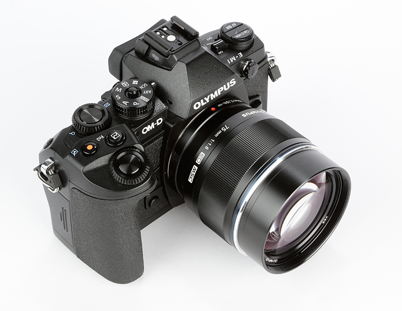

Passionné de photo depuis très longtemps, j'ai investi il y a quelques années dans [l'excellent boitier expert Canon EOS 5D Mark II](http://www.naturepixel.com/canon_5d_mk2_caracteristiques_essais_photos.htm) et quelques objectifs pro, dont le fabuleux 135mm f/2.0. Mais voilà, tout ça pèse lourd, très lourd, et se balader avec plusieurs objectifs est compliqué et pénible. Cet Olympus OM-D E-M1 pourrait bien être l'alternative légère que j'attends depuis des mois.

# Le boitier

Les premiers tests publiés sur des blogs spécialisés et dans la presse sont sans équivoque, ce boitier micro 4/3 est au niveau des meilleurs reflex, au point de titiller certains pros :

- Des tests très détaillés par Ming Thein, en plusieurs parties :
    - [The 2013 Olympus OM-D E-M1 review, part one: the camera](http://blog.mingthein.com/2013/09/10/olympus-om-d-e-m1-review-1/)
    - [The 2013 Olympus OM-D E-M1 review, part two: some comparisons](http://blog.mingthein.com/2013/09/11/the-2013-olympus-om-d-e-m1-review-2/)
    - [Olympus OM-D E-M1 review updated with thoughts on RAW quality](http://blog.mingthein.com/2013/09/18/olympus-om-d-e-m1-review-updated-with-thoughts-on-raw-quality/)

- Un premier aperçu par Jean-François Vibert, de [macandphoto.com](http://www.macandphoto.com/)[^1] : [Olympus OM-D E-M1, retour vers les professionnels ?](http://www.macandphoto.com/2013/09/olympus-om-d-em-1-le-retour-vers-les-pro-.html)
- Un test dans le [numéro d'octobre 2013 de Chasseur d'Images](http://www.chassimages.com/index.php?mact=News,cntnt01,detail,0&cntnt01articleid=103&cntnt01returnid=58) et [les réactions sur le forum associé](http://www.chassimages.com/forum/index.php/topic,192711.0.html)
- Une *preview* sur le site de référence Digital Photography Review (a.k.a. DPReview) : [Olympus E-M1 First Impressions Review](http://www.dpreview.com/previews/olympus-om-d-e-m1/)

Le boitier est tropicalisé pour résister sans frayeur aux poussières et éclaboussures, ainsi qu'aux températures basses jusqu'à -10°C, ce qui m'a déjà servi plusieurs avec mon 5D Mark II.

# La compacité

Mon objectif principal, si je change de boitier, c'est de gagner en encombrement et transportabilité, tant sur les dimensions que sur le poids.

La mise en évidence des [tailles relatives du Canon 5D Mark II et de l'Olympus OM-D E-M1 sur le site camerasize.com](http://camerasize.com/compare/#482,192) est éloquente :

Le capteur étant plus petit, les objectifs peuvent aussi l'être, donc c'est tout gagnant sur ce point.

# Le viseur

C'est là que réside ma plus grosse crainte. Je n'ai pas eu l'occasion de beaucoup jouer avec un EFV, mais ceux que j'ai testé au salon de la photo 2012 — dont le Fuji X-E1, qui était annoncé comme étant le meilleur, et certains Sony — m'ont vraiment fait fuir, tant ils étaient mauvais par rapport à mon viseur optique actuel.

Presque toutes les critiques disent que l'EVF4 de l'OM-D E-M1 est génial, mais je demande à voir avant de vraiment investir. D'autant plus que les commentaires, dans les forums de Chasseur d'Images par exemple, peuvent être [très négatifs](http://www.chassimages.com/forum/index.php/topic,192711.msg4164695.html#msg4164695) :

> En passant un point de vue sur les viseurs, de quelqu'un qui a des reflex (argentiques et numériques) et le nouveau VF-4 (équivalent du viseur de l'E-M1). La progression des EVF est très importante, c'est indéniable, surtout pour quelqu'un qui a aussi traîné longtemps un FZ50… Mais, **franchement, prétendre que le confort visuel d'un viseur électronique, serait-il le très bon VF-4, est soit de la méconnaissance de ce dont on parle, soit de la mauvaise foi**. Et j'aime vraiment beaucoup ce VF-4 et toutes les infos qu'on peut mettre dedans, et la photo qu'on voit comme elle va être, patin, couffin. Mais **ça reste du viseur électronique pas très confortable et pas très performant dans beaucoup de conditions de PdV**. Mais bien sûr, si on passe une vie à manger au Mac Do on peut toujours traiter le bon restaurant d'à côté de ringard…

… comme [très positifs](http://www.chassimages.com/forum/index.php/topic,192711.msg4175016.html#msg4175016) :

> Je ne peux que confirmer..**ce VF-4 est une tuerie**….mais aussi une arme à double tranchant par son côté addictif. je m'étais habitué sans problème aucun au viseur de l'EM-5 et là quand je le reprend après avoir quitté l'EP-5 ça fait quand même un vieux choc, ce viseur ample ajouté au *focus peaking* et à la mise au point manuelle qui s'enclenchent automatiquement ensemble dés qu'on touche la bague de mise au point de n'importe quel objectif M4/3 ça change la vie d'un vieux photographe à lunettes. Je pense même que **je ne reviendrais pas facilement à un viseur optique**, chose impensable pour moi il y a peu…

# La vidéo

Je suis plus photographe que vidéaste, mais j'avoue m'être fait plaisir à filmer quelques scènes en Full HD depuis que j'ai le 5D Mark II. Sauf qu'il est plutôt mauvais en termes d'auto focus, et que de nombreux progrès ont été faits sur tous les appareils photo depuis.

[La qualité vidéo semble au rendez-vous sur l'Olympus](https://www.flickr.com/photos/terakopian/9728785773/), même si certains concurrents font mieux pour les puristes.

# Les objectifs

Bien entendu, les objectifs sont essentiels dans un équipement photo, sans doute même plus que le boitiers, ceux-ci étant bien plus pérennes s'ils sont de qualité.

Si j'en crois les nombreux tests détaillés par Ming Thein, ou [ce billet de The Luminous Landscape](http://www.luminous-landscape.com/reviews/lenses/one_upon_a_time.shtml), il ne sera en fait pas si difficile de remplacer mes excellents objectifs actuels en gardant les mêmes qualités :

|Objectifs Canon pour Full Frame|Objectifs équivalents[^2] pour Olympus micro 4/3|Remarques|
|-
|EF 24-70mm f/2.8 L USM|[12-40/2.8 M.Zuiko PRO](http://blog.mingthein.com/2013/09/13/lens-review-the-olympus-12-40/)||
|EF 100mm f/2.8 Macro|[ZD 60mm f2.8 Macro](http://blog.mingthein.com/2012/09/21/olympus-60-2-8-macro/)|On arrive à un équivalent 120mm, mais cela ne devrait pas changer grand chose.|
|[EF 135mm f/2.0 L USM](http://www.naturepixel.com/canon_ef_135mm_f2,0_l_essai_photo_5d_mark2.htm)|[ZD 75/1.8](http://blog.mingthein.com/2012/07/22/review-the-olympus-zd-751-8-for-micro-four-thirds/)|Cette ouverture à f/1.8 sur un micro 4/3 est assez loin du f/2.0 du Full Frame, donc le bokeh risque d'être moins important, même si c'est un équivalent 150mm, à vérifier.|

Je ne tiens pas compte pour l'instant de mon bon vieux Canon EF 70-300mm, que j'aurais éventuellement remplacé par un 70-200mm de série L, mais un 40-150mm f/2.8 est prévu chez Olympus en 2014, j'ai tout mon temps.

# Les accessoires

Il va falloir également que je m'intéresse à ce qui est disponible pour toutes sortes d'accessoires pratiques voire indispensables :

- filtres polarisants;
- filtres neutres;
- télécommande, même si le *smartphone* peut le faire, pour les déclenchements sans vibration, le mode « *bulb* », l'intervalomètre, etc.;
- flash;
- flash déporté;
- etc.

# Encore plus extrême ?

Je pourrais aller encore plus loin et m'intéresser de plus près au Panasonic Lumix GM1 [qui est paraît-il excellent](http://www.expertreviews.co.uk/digital-cameras/1303702/panasonic-lumix-dmc-gm1), et dont l'[écart de taille avec le Canon 5D Mark II](http://camerasize.com/compare/#192,491) est vraiment impressionnant :

Mais dans ce cas, plus de viseur, ce qui me retient très fortement.

Je tenterais quand même d'en essayer un pour voir, ça m'intrigue.

[^1]: Et accessoirement, qui m'a formé à Lightroom au sein de la [Nikon School](http://www.nikon-school.fr/) !

[^2]: Ou suffisamment approchants…
