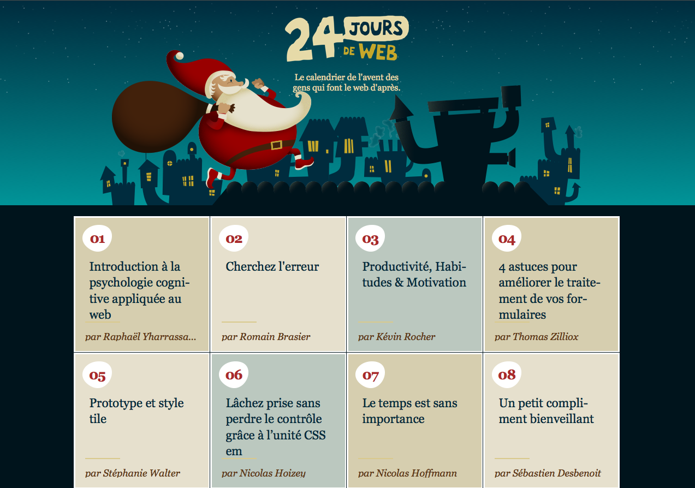

Après avoir eu des retours plutôt nombreux et positifs suite à [ma conférence à Paris Web 2013](/2013/10/ma-conference-a-paris-web-2013.html), j'ai retroussé mes manches pour proposer une version plus rédactionnelle, en essayant de retranscrire tout ce que j'ai dit mais pas mis dans mes slides, et même plus. Et j'ai la chance d'avoir vu ce très long article publié sur [24 Jours de Web](http://www.24joursdeweb.fr/), « le calendrier de l'avent des gens qui font le web d'après ».

L'article s'intitule « [Lâchez prise sans perdre le contrôle grâce à l’unité CSS em](http://www.24joursdeweb.fr/2013/lachez-prise-sans-perdre-le-controle-grace-a-l-unite-css-em/) » et fait plus de 5000 mots, alors prévoyez un peu de temps pour tout lire, et surtout bien comprendre.

L'accueil a été une nouvelle fois très positif si j'en crois les nombreux tweets, ce qui me rassure sur la pertinence de ma conviction en la matière, et sur celle de dire aujourd'hui tout haut ce que je pense depuis des années, sans jamais avoir jusqu'ici réussi à le démontrer de façon aussi satisfaisante.

Bonne lecture, n'hésitez pas à [commenter](http://www.24joursdeweb.fr/2013/lachez-prise-sans-perdre-le-controle-grace-a-l-unite-css-em/#commentaires) et à [faire un don](http://www.24joursdeweb.fr/2013/lachez-prise-sans-perdre-le-controle-grace-a-l-unite-css-em/#don) !

