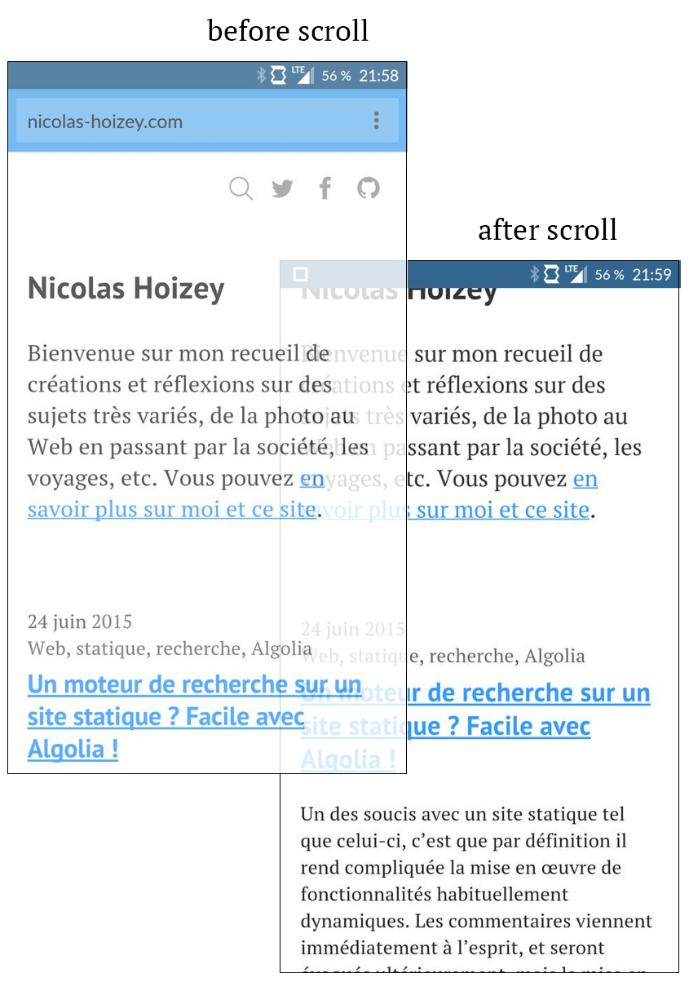

When trying to use [a `100vh` CSS value](http://caniuse.com/viewport-units) to build a new interface for [a game](http://esviji.com/) that would use the full viewport, I discovered that this full height value meant the bottom of the game interface was partialy hidden behind the browser buttons bar or below the "fold" of some mobile browsers.

# An issue with Apple iOS Safari

I first discovered this on my iPhone 5 and iPad 2.

Here is what [this page](http://lab.gasteroprod.com/vub/index-ios-issue.html) looks like on an iPhone 5 :

{.onehalf }

{.twothirds }

`100vh` is computed for when the browser interface is hidden, after a scroll :

{.onehalf }

{.twothirds }

As suggested by Yoav Weiss [there](https://twitter.com/yoavweiss/status/568145414320492544) and [there](https://twitter.com/yoavweiss/status/568713697306267648), I opened a bug in [Apple Bug Reporter](https://bugreport.apple.com/)(#19879505) and [Webkit Bugzilla](https://bugs.webkit.org/show_bug.cgi?id=141832).

## Description

When trying to use [a `100vh` CSS value](http://caniuse.com/viewport-units) to build an interface for [a game](http://esviji.com/) that would use the full viewport, I discovered that this full height value meant the bottom of the game interface was partialy hidden behind the browser buttons bar of Safari iOS on iPhone, or below the "fold" on iPad.

## Steps to Reproduce

1. Open http://lab.gasteroprod.com/vub/index-ios-issue.html on iOS Safari with an iPhone in portrait mode, or an iPad in portrait or landscape mode
2. The bottom part of the "bottom right" box is not visible, the 100vh height container being taller than the visible part

## Expected Results

I would have expected the viewport size (and the `100vh` dimension) to be equal to the visible part of the page in the browser. It's called **VIEW**port after all.

I understand it means the viewport changes when the browser interface hides, but I find it better, and necessary for "full viewport" interfaces. Fullscreen API is not available either, so there is no simple way to fix this behavior.

## Actual Results

The bottom part of the "bottom right" box is not visible, the `100vh` height container being taller than the visible part

## Configuration

iPhone 5 and iPad 2

## Version & Build

iOS 8.1.3 (12B466), and other versions in the iOS simulator

## Additional Notes

There is a JavaScript library that tries to fix some issues with viewport units in iOS, but it has issues too: [https://github.com/rodneyrehm/viewport-units-buggyfill/issues/13](https://github.com/rodneyrehm/viewport-units-buggyfill/issues/13)

# But not the only one…

In fact I saw later that iOS Safari is not the only one doing this.

## Firefox on Firefox OS

I discovered later the same behavior on the browser of Firefox OS:

# So what?

Are these behaviors browsers bugs, or the correct implementation of the standard, or is it open to interpretation?

# February 23rd update

[Webkit bug](https://bugs.webkit.org/show_bug.cgi?id=141832) has been set to **RESOLVED WONTFIX**, with this explanation:

> This is completely intentional. It took quite a bit of work on our part to achieve this effect. :)
>
> The base problem is this: the visible area changes dynamically as you scroll. If we update the CSS viewport height accordingly, we need to update the layout during the scroll. Not only that looks like shit, but doing that at 60 FPS is practically impossible in most pages (60 FPS is the baseline framerate on iOS).
>
> It is hard to show you the "looks like shit" part, but imagine as you scroll, the contents moves and what you want on screen is continuously shifting.
>
> Dynamically updating the height was not working, we had a few choices: drop viewport units on iOS, match the document size like before iOS 8, use the small view size, use the large view size.
>
> From the data we had, using the larger view size was the best compromise. Most website using viewport units were looking great most of the time.

# March 4th update

The issue on Apple Bug Reporter has been closed with this comment:

> This issue behaves as intended.

Meh…

The W3C CSS Working Group replied on Twitter with links to past discussions:

https://twitter.com/csswg/status/571742414299246592

# March 9th update

The W3C CSS Working Group suggestion doesn't fix anything, in iOS at least. Test it [live here](http://lab.gasteroprod.com/vub/index-ios-overflow.html).

# June 30th update

Boris, a friend, told be he saw a disturbing behavior of my text content when scrolling on this site:

> @nhoizey j'ai un changement de taille de police au scroll… Bizarre!
>
> — Boris 🚀 (@borisschapira) June 30, 2015

{#
Boris deleted his tweet: https://twitter.com/borisschapira/status/615972778236182528
#}

In fact, the viewport height changes when he scrolls and the browser chrome hides. Combine this with the fact that he `font-size` is partialy based on a `vh` value, and you understand that when scrolling and hiding the browser chrome, the text size was growing.

Here is a visual demonstration, from [two](https://twitter.com/borisschapira/status/615981753002557440) [screenshots](https://twitter.com/borisschapira/status/615981790113714176) he gave me:

{.onehalf }

Boris uses a [OnePlus One](https://oneplus.net/one) running Android 5.0.2 and Chrome 43.0.2357.93.

So there is at least one browser that behaves as I want for my full height game screen… but it makes users wonder if there is an issue…

# January 19th, 2016 update

People developing Chrome for Android [now plan to change its behavior to match iOS Safari's one](https://groups.google.com/a/chromium.org/forum/#!topic/blink-dev/BK0oHURgmJ4), claiming that “Safari’s been doing this for years without user/developer complaint”.

[I've tried to answer](https://groups.google.com/a/chromium.org/d/msg/blink-dev/BK0oHURgmJ4/WTFI3pifBAAJ)[^thanksyoav], but I don't believe it will change anything. At least, we will have the same "bug" everywhere…

[^thanksyoav]: Thanks Yoav for the [notification](https://twitter.com/yoavweiss/status/689568512562577408) about this discussion!

# November 8th, 2016 update

Chrome will indeed [now work like Safari](https://www.chromestatus.com/features/6241601772847104).

There is a lot of interesting informations in [this study](https://github.com/bokand/URLBarSizing#proposed-changes-to-chrome) about the differences between mobile browsers, and the proposed consensus.

# December, 2016 update

David Bokan explains how Chrome will now behave starting with version 56: [URL Bar Resizing](https://developers.google.com/web/updates/2016/12/url-bar-resizing).

Unfortunately:

> The unintuitive choice of making vh units the largest possible viewport but the ICB the smallest possible is to match Safari's behavior.

*[ICB]: Initial Containing Block

# January 3rd, 2017 update

[Jeremy Keith made the same observation](https://adactio.com/journal/11690), and concluded that "the result of this messiness is that the vh unit is practically useless for real-world situations with real-world devices".

# February 22nd, 2017 update

Peter-Paul Koch makes the same observation that viewport size is a tricky topic, with many disparities among browsers, in his post [Toolbars, keyboards, and the viewports](https://medium.com/samsung-internet-dev/toolbars-keyboards-and-the-viewports-10abcc6c3769#.h7jmkzqin).
